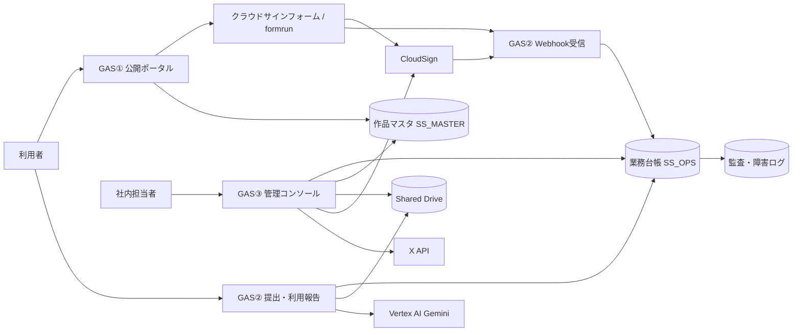
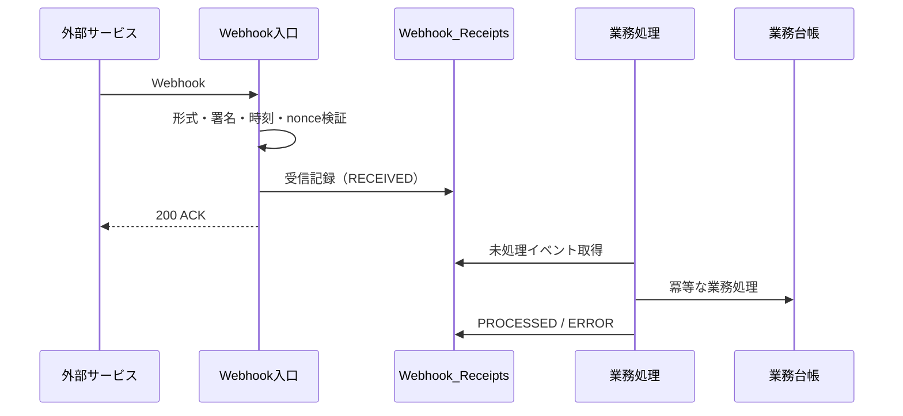
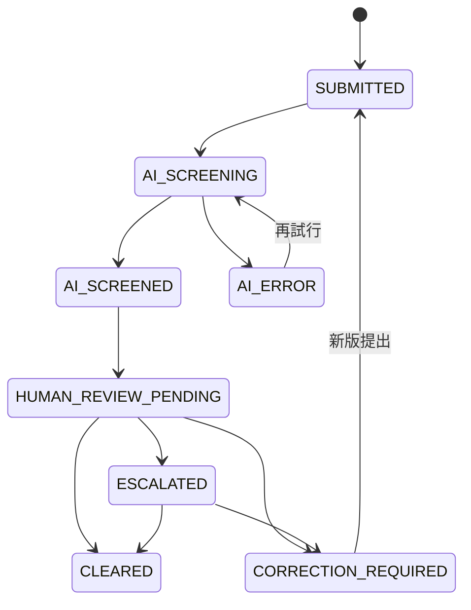
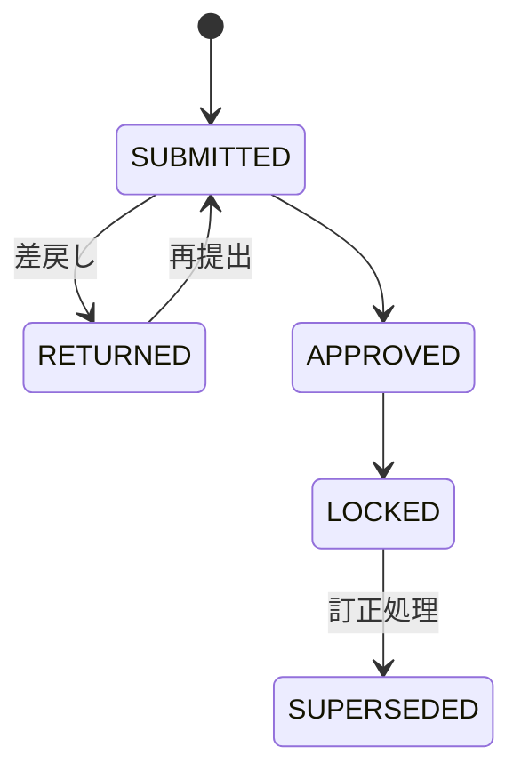

# SPLL 修正設計書

**文書番号**：SPLL-SYS-RD-001  
**版**：v1.0 Draft  
**作成日**：2026-07-14  
**対象リポジトリ**：`tatsuyakuramchi/SPLL`  
**基準ブランチ**：`claude/new-design-implementation-wlqwv9`  
**作成部門**：株式会社アークライト 法務部  
**対象システム**：SPLL 利用申込・契約・作品審査・利用報告・清算システム

---

## 0. 文書の位置付け

本書は、現行SPLL参照実装について実施した以下のレビュー結果を、実装可能な修正仕様へ落とし込むための設計書である。

1. 未実装・実装未完了箇所
2. セキュリティ上の問題
3. 業務フローとの不整合

現行コードは、Google Workspace、Google Apps Script（以下「GAS」）、CloudSign、クラウドサインフォーム powered by formrun、Google Drive、Vertex AI Gemini等を用いた参照実装である。本書では、画面モックまたはスケルトンの状態から、本番運用に耐える業務システムへ移行するために必要な修正方針、データモデル、権限制御、処理フロー、移行方法および受入条件を定める。

### 0.1 本書の優先順位

本書と既存資料・コードに不一致がある場合、実装着手時点では次の順序で取り扱う。

1. 法令、正式な契約書・利用規約および個人情報保護方針
2. 本書で「確定」とした仕様
3. `docs/SPLL_業務フロー確認資料_v0.2.md`
4. 現行コードおよびREADME
5. サンプルデータ、モック表示、コメント

### 0.2 用語

| 用語 | 意味 |
|---|---|
| GAS① | 公開ポータル。原作検索、申込作成、公開情報APIを提供する |
| GAS② | 契約・Webhook・提出・AI審査・利用報告等を担当する業務処理基盤 |
| GAS③ | 社内管理コンソール。審査、契約、請求、入金、清算、設定を管理する |
| 申込 | 公開ポータルで対象原作と利用目的を選択し、`application_ref` を発行した状態 |
| 契約 | CloudSignで締結完了した利用許諾契約 |
| 契約スナップショット | 締結時点の対象原作、許諾条件、料金、規約版等を変更不能な証跡として保存した情報 |
| 認証 | 正規ライセンスであることを示す台帳上の証明状態 |
| バッジ | 認証情報を表示するPNG画像 |
| 提出トークン | 作品提出ページへアクセスするための期限付き秘密情報 |
| 報告トークン | 利用報告ページへアクセスするための期限付き秘密情報 |
| 正本 | 業務上の正式な記録。原則として業務台帳と原本ファイルを指す |

---

# 1. 修正目的・対象範囲

## 1.1 修正目的

- 匿名公開領域と社内管理領域を分離し、最小権限で運用する
- Webhook偽造、管理機能の匿名実行、任意ファイル投入等の重大リスクを解消する
- 申込から契約、提出、AI審査、人手審査、利用報告、請求、入金、清算までを接続する
- 契約条件、規約、同意内容および操作履歴を後日復元できる証跡を残す
- 複数原作を含む契約について、対象原作、権利者、料金および配分を一貫して管理する
- 本番、検証、開発環境を分離し、安全にリリースできる状態にする

## 1.2 対象範囲

### 対象

- GASプロジェクトの分離
- 公開ポータル
- CloudSign・formrun連携
- 契約登録・契約スナップショット
- 提出・版管理
- Vertex AI Gemini一次審査
- 人手審査・是正・上申
- 利用報告
- 請求・入金
- 半期清算・仕入明細書
- 認証・バッジ・失効
- X投稿
- 個人情報、秘密情報、監査ログ、データ削除
- セットアップ、移行、テスト、リリース

### 対象外

- CloudSignまたはformrun自体のサービス仕様変更
- 会計システムへの本接続。ただし接続可能なインターフェース設計までは対象とする
- Geminiモデルの法的評価または審査結果の完全性保証
- 正式な利用規約、契約書および仕入明細書の法務確定
- X API利用申請、CloudSignプラン契約等の外部サービス契約手続

---

# 2. 現状評価と対応方針

## 2.1 総合評価

現行実装は、画面、主要テーブル、処理関数および業務フローの概念実証としては有用である。他方、現行の単一GASプロジェクトを匿名公開すると、管理機能および広範なOAuth権限が同一実行主体に集約される。加えて、Webhook真正性検証、管理関数の認可、請求起票、報告承認等が未完成である。

したがって、既存コードへ個別修正を積み重ねるだけでなく、次の構造変更を前提とする。

1. 3GASプロジェクトへの物理分割
2. 共有処理のライブラリ化または複製管理
3. 管理系関数へのサーバー側認証・認可
4. 外部イベントの受信記録と非同期業務処理の分離
5. 契約・規約・同意のスナップショット化
6. ステータス遷移の一元管理

## 2.2 重要度区分

| 区分 | 定義 | リリース判断 |
|---|---|---|
| Critical | 権限逸脱、契約偽造、個人情報漏えい、重大なデータ破壊に直結する | 本番公開前に必須 |
| High | 業務フローが完結しない、重要証跡が欠落する、金銭計算を誤る | 本番公開前に原則必須 |
| Medium | 運用負荷、復旧性、表示不整合、将来的な事故につながる | 初回安定化リリースまでに対応 |
| Low | UI、運用補助、保守性等 | 段階対応可 |

## 2.3 対応方針一覧

| ID | 現状課題 | 重要度 | 修正方針 |
|---|---|---:|---|
| SEC-01 | 匿名公開Webアプリに管理画面・管理関数が同居 | Critical | GAS①②③を物理分割し、GAS③を組織内限定公開にする |
| SEC-02 | 管理関数に認可処理がない | Critical | 全管理関数の入口で `requireRole_()` を実行する |
| SEC-03 | CloudSign Webhookの真正性未確認 | Critical | 署名・共有秘密・API照会等、利用可能な検証手段を組み合わせる |
| SEC-04 | formrun署名検証が常に成功 | Critical | 公式仕様に基づくHMAC等を実装し、未設定時は本番受信を拒否する |
| SEC-05 | ファイル制限がクライアント側のみ | High | サーバー側でサイズ、MIME、拡張子、マジックバイト、回数を検証する |
| SEC-06 | 利用報告トークンが期限を確認しない | High | 提出用と報告用のトークンを分離し、用途・期限・回数を検証する |
| FUN-01 | 利用報告の承認・ロック未実装 | High | 管理画面に確認・差戻し・承認・ロックを実装する |
| FUN-02 | 請求作成未実装 | High | RATE・FLAT・PER_WORKごとの請求起票処理を実装する |
| FUN-03 | バッジ取得導線が成立しない | High | 契約ポータルまたは提出ページにバッジ取得導線を設ける |
| FUN-04 | 締結済PDFを保存しない | High | CloudSign APIから締結済原本を取得し、ハッシュ付きで保存する |
| FUN-05 | データ削除がTODO | High | 保有期間ポリシーに基づく匿名化・削除バッチを実装する |
| FLOW-01 | B経路固定なのにA/B項目が残る | High | A経路関連の列・表示・サンプルを廃止または非活性化する |
| FLOW-02 | 契約対象がwork IDのみ | High | 契約原作・条件・規約・同意をスナップショット保存する |
| FLOW-03 | 清算ステータスが画面とサーバーで不一致 | High | 共通定数を採用し、画面・バッチ・資料を統一する |
| FLOW-04 | 複数原作配分がパートナー数基準 | High | 配分スキームをマスタ化し、原作単位・権利者単位を明示する |
| OPS-01 | バッチトリガー未設定 | High | セットアップ時に必要トリガーを作成し、監視可能にする |
| OPS-02 | API障害時にサンプル表示 | Medium | 本番ではフェイルクローズし、申込を停止する |
| OPS-03 | テスト・lint・型検査なし | Medium | CIまたはローカル検査スクリプトを追加する |

---

# 3. 修正後アーキテクチャ

## 3.1 物理構成



## 3.2 GASプロジェクト別責務

### GAS① 公開ポータル

- 公開原作の検索・表示
- 利用目的・料金条件の表示
- 規約・個人情報同意文の表示
- 申込参照番号の発行
- 申込対象原作の記録
- formrunへの遷移

**公開範囲**：匿名公開  
**OAuth権限**：原則として対象Spreadsheetへの限定的な読取り・書込みのみ  
**禁止事項**：Drive原本、CloudSign資格情報、管理設定、X資格情報へのアクセス

### GAS② 契約・提出・報告・Webhook

- formrun Webhook受信
- CloudSign Webhook受信
- 契約登録
- 締結済原本取得
- 認証・バッジ発行
- 提出・版管理
- Gemini審査
- 利用報告
- バッチ処理
- 外部向けトークンページ

**公開範囲**：必要なエンドポイントのみ匿名公開  
**実行方法**：デプロイユーザーとして実行  
**防御**：Webhook検証、用途別トークン、レート制限、入力検証

### GAS③ 管理コンソール

- 審査
- 契約紐付け
- 請求
- 入金
- 清算
- 認証状態変更
- マスタ・設定管理
- X投稿
- 障害・監査ログ閲覧

**公開範囲**：Google Workspace組織内限定  
**防御**：Googleアカウント認証＋RBAC  
**禁止事項**：匿名アクセス時のフォールバック表示

## 3.3 共有コード

GAS①②③に共通する定数・スキーマ・ステータス定義は、次のいずれかで管理する。

- 推奨：共通GASライブラリ
- 代替：`shared/` 配下のソースをビルド時に各プロジェクトへ配布

少なくとも以下は単一の定義元を持つ。

- ステータス定義
- ID採番規則
- 監査ログ形式
- HTMLエスケープ
- Spreadsheet書込み時の無害化
- 日付・期間計算
- エラーコード
- ロール定義

---

# 4. 認証・認可設計

## 4.1 ロール

| ロール | 主な権限 |
|---|---|
| `SYSTEM_ADMIN` | 全設定、管理者設定、データソース、秘密情報設定 |
| `LEGAL_ADMIN` | 規約、契約、審査、認証状態、法務エスカレーション |
| `OPERATIONS` | 作品マスタ、提出リンク、通常審査、利用者対応 |
| `ACCOUNTING` | 利用報告承認、請求、入金、清算 |
| `AUDITOR` | 読取り専用。契約、ログ、清算、設定変更履歴 |
| `PUBLIC` | 公開APIのみ |

## 4.2 管理関数の認可

全ての `admin_` 関数は、処理冒頭で次の形式の認可を行う。

```javascript
function admin_recordPayment(...) {
  const actor = requireRole_(['ACCOUNTING', 'SYSTEM_ADMIN']);
  // 業務処理
}
```

`requireRole_()` は次を実施する。

1. `Session.getActiveUser().getEmail()` の取得
2. メール未取得の場合は拒否
3. `Admin_Users` テーブルから有効なロールを取得
4. 許可ロール外の場合は拒否
5. 操作者情報を監査ログへ引き渡す

クライアント側のボタン非表示は補助的なUI制御に限り、認可判断には使用しない。

## 4.3 初期管理者

匿名公開状態から管理者を登録できるbootstrapモードは廃止する。初期管理者は次のいずれかで登録する。

- Apps Scriptエディタから一回限りのセットアップ関数を実行
- ScriptPropertiesへ事前登録
- 管理者用Spreadsheetへ管理者が直接登録

初期登録後に、公開URLから管理者設定を変更できないことを受入条件とする。

---

# 5. 外部連携・Webhook設計

## 5.1 受信共通フロー



外部サービスへの応答と業務処理を分離する。受信済みフラグを業務処理完了前に「完了」と扱わない。

## 5.2 `Webhook_Receipts`

| カラム | 内容 |
|---|---|
| `receipt_id` | 内部ID |
| `provider` | `CLOUDSIGN / FORMRUN` |
| `external_event_id` | 外部イベント識別子 |
| `payload_hash` | 受信本文のSHA-256 |
| `signature_valid` | 検証結果 |
| `received_at` | 受信日時 |
| `status` | `RECEIVED / PROCESSING / PROCESSED / ERROR / REJECTED` |
| `retry_count` | 再試行回数 |
| `last_error` | 最終エラー |
| `processed_at` | 処理完了日時 |

## 5.3 CloudSign Webhook

CloudSign Webhookは、利用可能な公式仕様に応じて次の検証を組み合わせる。

1. 共有秘密または署名ヘッダの検証
2. イベント内のdocument IDを用いたCloudSign API照会
3. API照会結果が締結完了であることの確認
4. document ID、ステータス、更新日時の整合確認
5. document ID単位の冪等処理
6. `application_ref` の照合
7. 未照合時は `UNLINKED` とし、認証・バッジ・提出トークンを発行しない

CloudSign側が署名機構を提供しない場合でも、API照会を必須とし、受信payloadだけで契約を作成しない。

## 5.4 formrun Webhook

- `FORMRUN_WEBHOOK_SECRET` 未設定時は、本番環境では受信を拒否する
- 公式仕様に従ってHMAC等を検証する
- 受信時刻の許容差を設ける
- 同一イベントの再送を冪等処理する
- `application_ref` が存在しない場合はエラーキューへ送る
- 申込ステータスの逆行を禁止する

---

# 6. 入力・ファイルセキュリティ設計

## 6.1 共通入力検証

サーバー側で次を検証する。

- ID形式
- 列挙値
- 文字数
- 数値範囲
- 日付形式
- URLスキーム
- 改行・制御文字
- 対象レコードの存在
- 現在ステータスから許容される遷移
- 対象レコードとトークンの所有関係

## 6.2 Spreadsheet数式インジェクション対策

外部入力をSpreadsheetへ保存する際、先頭文字が `=`, `+`, `-`, `@` の場合は文字列として保存する共通関数を使用する。金額等の数値は文字列経由ではなく数値型へ正規化して保存する。

## 6.3 アップロード制限

### 許可形式

- PDF
- PNG
- JPEG

### サーバー側検証

- Base64デコード後の実サイズ：最大20MB
- MIMEタイプ
- 拡張子
- ファイル先頭シグネチャ
- 空ファイル拒否
- 1回の送信ファイル数
- トークンごとの最大提出回数
- 契約ごとのストレージ上限
- 危険なファイル名の正規化
- Gemini対応形式であること

不一致の場合はDriveへ保存する前に拒否する。

## 6.4 レート制限

次のキー単位で回数を制限する。

- Webhook：provider＋event ID
- 提出：token ID＋時間帯
- 利用報告：token ID＋時間帯
- 認証照会：cert ID＋時間帯
- 公開申込：セッション識別子または生成回数

GASの制約上、完全なWAF代替とはならないため、高負荷または攻撃対策が必要な場合はCloud Run等の前段を検討する。

---

# 7. 申込・同意証跡設計

## 7.1 申込作成時の検証

`web_createApplication` は次を確認する。

- 対象原作が `Works_Master` に存在する
- `publish_status = PUBLISHED`
- 有効期間内である
- 選択件数が最大件数以下
- 利用目的が有効な `Fee_Schedule` に存在する
- 料金条件が計算可能
- 規約および個人情報同意文が有効版として公開されている

## 7.2 同意証跡

### `Legal_Documents`

| カラム | 内容 |
|---|---|
| `legal_document_id` | 文書ID |
| `document_type` | `PRIVACY / TERMS / GUIDELINE` |
| `version` | 版番号 |
| `content_html` | 表示本文 |
| `content_hash` | SHA-256 |
| `effective_from` | 適用開始 |
| `effective_to` | 適用終了 |
| `status` | `DRAFT / PUBLISHED / RETIRED` |
| `approved_by` | 承認者 |
| `approved_at` | 承認日時 |

### `Application_Consents`

| カラム | 内容 |
|---|---|
| `consent_id` | 同意ID |
| `application_id` | 申込ID |
| `document_type` | 文書種別 |
| `legal_document_id` | 同意対象文書 |
| `content_hash` | 同意時ハッシュ |
| `consented_at` | 同意日時 |
| `consent_method` | `PORTAL_CHECKBOX / FORMRUN` |
| `evidence_ref` | 外部証跡ID等 |

公開画面でチェックしただけでは最終契約同意の証跡として不十分な場合、formrun・CloudSign側の証跡IDも紐付ける。

## 7.3 申込参照番号

- `application_ref` は推測耐性を高めるため、連番のみではなくランダム要素を含める
- 表示用refと内部主キーを分離する
- URLへ渡す場合でも、ref単独で管理情報を取得できないようにする

例：`REF-202607-X7K4Q9`

---

# 8. 契約登録・スナップショット設計

## 8.1 契約成立処理

CloudSign締結完了を検証後、次を一つの論理トランザクションとして実施する。

1. `Contracts` 作成
2. `Contract_Works` 作成
3. `Contract_Terms` 作成
4. `Contract_Legal_Snapshots` 作成
5. 締結済PDF取得・保存
6. PDFハッシュ記録
7. `Applications` を `SIGNED` に更新
8. 認証発行
9. バッジ発行
10. 提出トークン・報告トークン発行
11. Events記録

途中失敗時は `CONTRACT_PROCESSING_ERROR` とし、再実行可能にする。

## 8.2 `Contracts` 追加項目

| カラム | 内容 |
|---|---|
| `contract_id` | 契約ID |
| `application_id` | 申込ID |
| `cloudsign_document_id` | CloudSign書類ID |
| `cloudsign_status` | CloudSign状態 |
| `status` | 内部契約状態 |
| `link_status` | `LINKED / UNLINKED` |
| `signed_at` | 締結日時 |
| `contract_file_id` | 締結済PDF |
| `contract_file_hash` | PDF SHA-256 |
| `contract_version` | 契約ひな形版 |
| `folder_id` | 契約フォルダ |
| `created_at` | 登録日時 |

## 8.3 `Contract_Works` のスナップショット化

現行のwork IDだけでなく、次を保存する。

- work ID
- 作品名
- 出版社・権利者表示
- 許諾要素
- 禁止要素
- 対象媒体
- クレジット表記
- 審査ルール版
- partner ID
- 配分スキームID
- 原作マスタ行のハッシュ

契約後に作品マスタが変更されても、契約時点の条件を復元できるようにする。

## 8.4 `Contract_Terms`

| カラム | 内容 |
|---|---|
| `contract_term_id` | 条件ID |
| `contract_id` | 契約ID |
| `usage_category` | 利用目的 |
| `fee_model` | `RATE / FLAT / PER_WORK` |
| `rate` | 率 |
| `amount` | 固定金額 |
| `licensed_uses` | 許諾対象利用 |
| `payment_due` | 支払期日 |
| `reporting_requirement` | 報告義務 |
| `report_due` | 報告期限 |
| `threshold_or_cap` | 上限 |
| `reprint_rule` | 増刷等 |
| `special_terms` | 特約 |
| `source_fee_schedule_hash` | 料金表証跡 |
| `snapshot_at` | 固定日時 |

---

# 9. 提出・版管理・AI審査

## 9.1 トークン分離

現行の `Submission_Access` を用途別に統合管理する。

### `Access_Tokens`

| カラム | 内容 |
|---|---|
| `token_id` | トークンID |
| `contract_id` | 契約ID |
| `purpose` | `SUBMISSION / REPORT / BADGE_DOWNLOAD` |
| `token_hash` | ハッシュ |
| `status` | `OPEN / USED / REVOKED / EXPIRED` |
| `expires_at` | 有効期限 |
| `max_uses` | 最大利用回数 |
| `used_count` | 利用回数 |
| `last_used_at` | 最終利用 |
| `issued_at` | 発行日時 |
| `revoked_at` | 失効日時 |

平文トークンは発行時のみ返し、台帳には保存しない。再発行時は旧トークンを `REVOKED` にする。

## 9.2 提出フロー



## 9.3 AI審査結果

次の項目を保存する。

- overall result
- risk score
- human review required
- work ID
- rule ID
- severity
- result
- page
- evidence
- recommended action
- confidence
- prompt version
- model
- request hash
- response原本ファイルID
- 実行日時
- エラー内容

AIの生レスポンスは改変せずDriveへ保存し、台帳には検索・表示に必要な構造化項目を保存する。

## 9.4 人手審査

- `CLEARED`、`CORRECTION_REQUIRED`、`ESCALATED` の列挙値をサーバー側で検証する
- 対象版が最新版であることを確認する
- 是正要求・上申時はコメント必須
- 審査者をクライアント入力から受け取らず、認証済み操作者から取得する
- 上申時はエスカレーション先、期限、担当者を記録する
- 審査結果通知は通知キューへ登録する

---

# 10. 利用者通知設計

当社がメールアドレスを保持しない方針を維持する場合、通知方法を明確にする必要がある。

## 10.1 推奨方式

CloudSignまたはformrunに連絡先管理を委ね、当社システムは外部サービス上の申込ID・書類IDのみ保持する。通知が必要な場合は、CloudSign/formrunの機能または事務局の外部管理画面から送信する。

## 10.2 システム内通知キュー

`Notification_Queue` を設け、システムは「誰に何を通知すべきか」を記録する。

| カラム | 内容 |
|---|---|
| `notification_id` | ID |
| `contract_id` | 契約 |
| `type` | `UPLOAD_GUIDE / CORRECTION_REQUEST / REVIEW_RESULT / REPORT_REQUEST` |
| `external_recipient_ref` | formrun・CloudSign側参照 |
| `template_id` | テンプレート |
| `payload_json` | 差込値 |
| `status` | `PENDING / SENT / FAILED / MANUAL_REQUIRED` |
| `sent_at` | 送信日時 |

メール非保持のまま自動送信できない場合は `MANUAL_REQUIRED` とし、管理画面へ表示する。

---

# 11. 利用報告・請求・入金設計

## 11.1 利用報告

### 入力検証

- 報告対象期間が契約上有効
- 同一契約・期間・チャネルの重複
- 数量、売上、返品、控除が0以上
- 控除が総売上を超えない
- URLがHTTP/HTTPS
- トークンの用途・期限・回数
- RATE契約または報告義務ありの契約であること

### ステータス



### 管理機能

- 内容確認
- 証憑URL確認
- 差戻し
- 承認
- ロック
- 訂正版作成
- 変更履歴確認

## 11.2 請求起票

### RATE

- 承認済み利用報告を基に請求金額を算出
- `net_sales × royalty_rate`
- 丸め規則を契約条件に保持
- 期間単位で請求書を起票

### FLAT

- 契約締結時に固定額の請求候補を自動起票
- 契約条件に定めた支払期日を設定
- 無償の場合は請求を作らず `NOT_REQUIRED` とする

### PER_WORK

- `単価 × 契約対象原作数`
- 締結時の対象原作数スナップショットを使用

## 11.3 `Invoices`

追加・見直し項目：

- invoice ID
- contract ID
- source type
- source record ID
- period
- subtotal
- tax rate
- tax amount
- total amount
- due date
- status
- issued at
- external accounting ID
- void reason
- version

ステータス：

`DRAFT → APPROVED → ISSUED → PAYMENT_PENDING → PAID / PARTIALLY_PAID / VOID`

## 11.4 入金

- 請求ID必須
- 金額・日付の型検証
- 過入金・不足入金を表示
- 同一入金の重複チェック
- 取消理由必須
- 認証を未入金で保留するかは法務・事業決定に従う

---

# 12. 清算・仕入明細書設計

## 12.1 配分計算

配分方式を `Allocation_Schemes` でマスタ化する。

| 方式 | 内容 |
|---|---|
| `BY_WORK_EQUAL` | 対象原作数で均等配分。同一権利者の複数原作分を合算 |
| `BY_PARTNER_EQUAL` | 重複除外した権利者数で均等配分 |
| `FIXED_PERCENT` | 原作・権利者ごとの固定比率 |
| `CUSTOM` | 契約時スナップショットの個別比率 |

現行の暗黙的なパートナー数均等は廃止し、契約ごとに方式を明示する。

## 12.2 清算計算の証跡

各明細に次を保存する。

- 利用報告ID
- 契約ID
- 原作ID
- partner ID
- 純売上
- 利用許諾料率
- 事務手数料率
- 配分方式
- 配分比率
- 丸め前金額
- 丸め後金額
- 税区分
- 適格請求書登録番号スナップショット
- 計算式バージョン

## 12.3 計算書ステータス

`DRAFT → APPROVED → OBJECTION_PERIOD → NO_OBJECTION_RECORDED / OBJECTION_RECEIVED → FINALIZED`

補助状態として `SEND_ERROR / SUPERSEDED / CANCELLED` を設ける。画面側に旧状態 `CONFIRMED / OBJECTED` を残さない。

## 12.4 仕入明細書

正式様式は法務・経理確定後に実装する。少なくとも次を含める。

- 発行者情報
- パートナー情報
- 対象期間
- 取引年月日または対象期間
- 契約・原作・利用報告の識別
- 純売上
- 利用許諾料率
- 事務手数料
- 配分額
- 税率・税額
- 合計額
- 登録番号
- 支払予定日
- 異議方法・異議期限
- 文書版、発行日時、文書ハッシュ

## 12.5 異議期間

- 発効日と異議期限を日付計算関数で明示的に算出
- 月末日の扱いをテストする
- 異議ありの場合は自動確定しない
- `NO_OBJECTION_RECORDED` は異議なしの事実記録であり、積極的承認を意味しない
- `FINALIZED` は権限を持つ担当者の操作で確定する

---

# 13. 認証・バッジ設計

## 13.1 認証

認証状態：

- `ACTIVE`
- `SUSPENDED`
- `REVOKED`
- `EXPIRED`
- `TERMINATED`
- `PAYMENT_HOLD`

状態変更時に次を必須とする。

- 理由コード
- 理由本文
- 申請者
- 承認者
- 法務案件ID
- 発効日時
- 変更前後状態

重要な失効は申請者と承認者を分離する。

## 13.2 照合コード

- 6桁固定は総当たり耐性が不足するため、少なくとも10〜12文字を推奨
- 暗号学的乱数を使用する
- コード自体ではなくハッシュを保存する
- QR URLへ認証IDと照合秘密を含める
- 認証照会はレート制限・アクセスログ対象とする

## 13.3 バッジ

バッジへ掲載する情報：

- SPLL正規ライセンス表示
- 対象原作名
- ライセンスID
- 発行日
- クレジット表記
- 検証QR
- バッジ版

クレジット表記は、契約時にスナップショットした対象原作の表示から生成する。

## 13.4 配布

- 契約成立時にバッジを生成
- バッジ取得URLを提出ページまたは専用契約ポータルに表示
- トークンは用途別・期限付き
- Driveファイルは直接一般公開せず、GAS経由で認可後に配信することを推奨
- 認証失効時は、既存画像が残っても検証ページで無効と表示する
- 必要に応じ、失効時にダウンロードトークンを無効化する

---

# 14. X投稿設計

- 投稿は必ずプレビューと人手承認を経る
- 投稿対象は `PUBLISHED` の作品のみ
- 同一公開版への重複投稿を防止する
- 再投稿は明示操作と理由を必要とする
- 投稿本文、投稿者、投稿日時、tweet ID、作品版をEventsへ記録する
- APIエラー時に公開処理自体をロールバックしない
- 資格情報はGAS③のScriptPropertiesのみへ保存する

`X_Posts` テーブルを設け、作品単位の単純なScriptPropertiesフラグを置き換える。

---

# 15. データモデル修正

## 15.1 追加テーブル

- `Admin_Users`
- `Legal_Documents`
- `Application_Consents`
- `Contract_Terms`
- `Contract_Legal_Snapshots`
- `Webhook_Receipts`
- `Access_Tokens`
- `Notification_Queue`
- `Allocation_Schemes`
- `X_Posts`
- `System_Errors`
- `Batch_Runs`

## 15.2 主な既存テーブル変更

### `Applications`

追加：

- `public_ref`
- `legal_terms_version`
- `privacy_version`
- `fee_snapshot`
- `expires_at`
- `cancelled_at`
- `cancel_reason`

### `Contract_Works`

追加：

- `work_name_snapshot`
- `publisher_snapshot`
- `allowed_elements_snapshot`
- `prohibited_elements_snapshot`
- `media_snapshot`
- `credit_snapshot`
- `partner_id_snapshot`
- `allocation_scheme_snapshot`
- `master_row_hash`

### `Submission_Files`

追加：

- `original_filename`
- `normalized_filename`
- `detected_mime_type`
- `magic_valid`
- `virus_scan_status`
- `uploaded_at`

### `AI_Review_Jobs`

追加：

- `overall_result`
- `risk_score`
- `human_review_required`
- `response_file_id`
- `started_at`
- `completed_at`
- `last_error`

### `Usage_Reports`

追加：

- `version`
- `approved_by`
- `approved_at`
- `locked_at`
- `returned_reason`
- `supersedes_report_id`

### `Events`

追加：

- `correlation_id`
- `request_id`
- `source`
- `result`
- `error_code`

## 15.3 行更新方式

現行の1セルずつ `setValue()` を繰り返す方式は、性能・部分更新リスクがある。更新対象行を配列として組み立て、可能な限り1回の `setValues()` で更新する。

採番、契約登録、清算生成等の競合が生じ得る処理は `LockService` を使用する。

---

# 16. ステータス遷移管理

ステータス更新を任意の `updateRow_()` 呼出しに分散させず、エンティティごとの遷移関数に集約する。

遷移関数は次を行う。

- 現在状態取得
- 許可遷移確認
- 更新
- Events記録
- 失敗時のエラー処理
- correlation ID付与

---

# 17. 画面修正

## 17.1 公開ポータル

- 本番環境でAPI取得に失敗した場合、サンプルデータを表示しない
- 「現在申込を受け付けられません」と表示する
- B経路固定のため審査タイミングA/Bを表示しない
- 公開原作、利用目的、料金条件をサーバー検証後に表示する
- 規約版・個人情報同意文版を画面に明示する
- 申込完了時に参照番号と有効期限を表示する

## 17.2 提出画面

- 契約ID、対象原作、提出履歴
- バッジ取得
- 認証状態
- トークン期限
- 残り提出回数
- 許可形式・最大サイズ
- 是正要求内容
- 最新版以外への誤再提出防止
- 二重送信防止

## 17.3 利用報告画面

- 契約上の対象媒体のみ選択可能
- 契約時の料金条件・報告期限を表示
- 実データの報告履歴
- 既報告期間の重複防止
- 控除の説明・証憑欄
- 送信前確認
- 訂正申請

## 17.4 管理コンソール

タブ構成：

1. ダッシュボード
2. 申込・契約
3. 作品提出・審査
4. 利用報告
5. 請求・入金
6. 清算
7. 認証・バッジ
8. 通知・エラー
9. マスタ・設定
10. 監査ログ

全画面でロールに応じた表示制御を行い、サーバー側でも同一権限を強制する。

---

# 18. バッチ・トリガー設計

| バッチ | 頻度 | 内容 |
|---|---|---|
| `processWebhookReceipts` | 5分ごと | 未処理Webhookの業務処理 |
| `runAiReviewJobs` | 5〜15分ごと | AI審査キュー |
| `expireAccessTokens` | 日次 | 期限切れトークンをEXPIREDへ |
| `notifyReviewSla` | 日次 | 審査期限超過を通知 |
| `notifyReportDue` | 日次 | 報告期限前後の通知キュー作成 |
| `generateSettlementDrafts` | 半期・手動 | 清算DRAFT生成 |
| `closeObjectionPeriods` | 日次 | 異議期間満了を記録 |
| `purgeOrAnonymizeData` | 日次または月次 | 保有期間に基づく削除・匿名化 |
| `healthCheckIntegrations` | 日次 | CloudSign、Drive、Gemini等の疎通確認 |

各バッチは `Batch_Runs` に開始・終了・処理件数・エラーを記録する。セットアップ関数は、既存トリガーを重複作成しないよう冪等にする。

---

# 19. 個人情報・秘密情報・ログ

## 19.1 個人情報

- 当社が保持しない情報と保持する情報をデータ項目単位で確定する
- 提出作品に個人情報が含まれる可能性を考慮する
- Geminiへ送信するデータ範囲を明確化する
- 住所、口座、電話、メール等をGeminiへ送信しない
- 保有期間、削除方法、開示等請求窓口を正式文書へ反映する
- 契約未成立申込の保有期間を定める
- 契約成立後の法定・業務保有期間を定める

## 19.2 秘密情報

次はScriptPropertiesまたはSecret Manager相当で管理し、Spreadsheetへ保存しない。

- CloudSign資格情報
- formrun Webhook secret
- X API資格情報
- 外部連携秘密
- 管理APIキー

読出しAPIは値を返さず、設定済みフラグだけを返す。

## 19.3 監査ログ

Eventsは追記専用とし、通常管理画面から編集・削除できないようにする。

記録対象：

- 設定変更
- 作品公開
- 規約公開
- 契約登録・手動紐付け
- 審査判断
- 請求承認
- 入金記録・取消
- 清算承認・異議・確定
- 認証状態変更
- トークン再発行
- X投稿
- データ削除
- 権限変更

機微情報・トークン・secret・作品全文はログへ記録しない。

---

# 20. データ削除・匿名化

## 20.1 削除ポリシー

削除要件は正式な個人情報保護方針・契約・税務保管要件確定後にConfigへ設定する。

対象例：

- 契約未成立申込
- 期限切れアクセスログ
- 一時ファイル
- AI処理用コピー
- 旧トークン
- CloudSign API一時レスポンス
- エラーpayload

## 20.2 削除方式

- 法的証跡が必要なレコードは削除せず匿名化
- 原本ファイルはDriveの専用廃棄フォルダを経て削除
- 削除前後に件数とハッシュを記録
- 削除失敗は再試行
- Events自体は原則保持するが、個人識別情報を含めない

---

# 21. エラー処理・復旧設計

## 21.1 エラー分類

| 区分 | 例 |
|---|---|
| `VALIDATION_ERROR` | 入力不正 |
| `AUTHENTICATION_ERROR` | 未認証 |
| `AUTHORIZATION_ERROR` | 権限不足 |
| `EXTERNAL_API_ERROR` | CloudSign、Gemini、X等 |
| `DATA_CONFLICT` | 重複・ステータス競合 |
| `DATA_NOT_FOUND` | 対象不存在 |
| `PROCESSING_ERROR` | 内部処理失敗 |

## 21.2 復旧

- 契約処理、AI審査、清算送信は再実行可能にする
- 外部API成功後、台帳更新に失敗した場合の照合・復旧画面を用意する
- 手動再処理では元イベント・元ジョブを参照する
- 失敗を握りつぶさず `System_Errors` に記録する
- 管理画面に未解決エラー件数を表示する

---

# 22. 環境・デプロイ設計

## 22.1 環境

- `development`
- `staging`
- `production`

環境ごとに次を分離する。

- GASプロジェクト
- Spreadsheet
- Drive
- CloudSignサンドボックス・本番
- GCP Project
- ScriptProperties
- Webhook URL
- X投稿先。stagingでは原則無効

## 22.2 リポジトリ構成案

```text
SPLL/
├── apps/
│   ├── portal/
│   ├── workflow/
│   └── admin/
├── shared/
│   ├── auth/
│   ├── data/
│   ├── status/
│   ├── security/
│   └── utils/
├── docs/
├── scripts/
├── tests/
├── package.json
└── README.md
```

## 22.3 設定ファイル

実ID・secretをGitへコミットしない。`.clasp.json` は環境ごとにローカル生成し、テンプレートのみ管理する。

---

# 23. テスト設計

## 23.1 単体テスト

- 料金計算
- 配分計算
- 日付・異議期限
- ステータス遷移
- ref抽出
- token検証
- MIME・サイズ検証
- Spreadsheet無害化
- HMAC検証
- 丸め・端数処理

## 23.2 結合テスト

- 公開申込→formrun
- formrun→申込状態更新
- CloudSign締結→契約登録
- 契約→バッジ・トークン
- 提出→Drive→Gemini→審査キュー
- 人手審査→是正→再提出
- 利用報告→承認→請求
- 入金→請求状態
- 清算→PDF→CloudSign
- 異議期間→確定
- 認証失効→検証画面

## 23.3 セキュリティテスト

- 匿名ユーザーによる全 `admin_` 関数呼出し
- 権限別の操作可否
- 偽造Webhook
- リプレイWebhook
- 不正ref
- 期限切れ・失効トークン
- 回数超過
- 任意MIME・巨大Base64
- 数式インジェクション
- HTML・スクリプト注入
- 認証コード総当たり
- API障害時のフェイルクローズ

## 23.4 金額テスト

- 0円
- 端数
- 複数原作
- 同一権利者の複数原作
- 複数権利者
- 固定額
- 原作数比例
- 売上連動
- 返品・控除
- 訂正版報告
- 過入金・不足入金
- 税率別計算

---

# 24. 移行設計

## 24.1 移行方針

1. 現行本番が未稼働の場合は、新構成へ再セットアップする
2. 既存テストデータがある場合は、移行対象を識別する
3. サンプルデータを本番へ投入しない
4. A経路関連項目をB経路へ変換または廃止する
5. 旧ステータスを新ステータスへマッピングする
6. 既存契約は可能な範囲で契約スナップショットを生成する
7. 移行前後の件数・金額・ハッシュを照合する

## 24.2 ステータスマッピング例

| 旧 | 新 |
|---|---|
| `CONFIRMED` | `NO_OBJECTION_RECORDED` または個別確認 |
| `OBJECTED` | `OBJECTION_RECEIVED` |
| `SENT`（計算書） | `OBJECTION_PERIOD` |
| A経路 `REJECTED` | 廃止区分としてアーカイブ |
| `review_timing=A` | B経路へ統一または非公開化 |

## 24.3 ロールバック

- 新旧GAS URLを一定期間併存させる
- Webhook切替時刻を記録する
- 新システムで重大障害が発生した場合、外部連携を停止し手動運用へ切り替える
- 金銭計算済みデータを自動削除・上書きしない

---

# 25. 実装フェーズ・WBS

## Phase 0：法務・業務確定

- 規約・個人情報文面
- 審査SLA
- 未成年・反社
- 解除
- 料率・事務手数料
- 配分方式
- 清算期日
- 仕入明細書様式
- 通知方法

## Phase 1：Criticalセキュリティ

- GAS分割
- 管理者認証・RBAC
- Webhook真正性
- 管理関数認可
- ファイル検証
- トークン分離
- API障害時のサンプルフォールバック廃止

## Phase 2：契約・証跡

- 同意証跡
- 契約スナップショット
- 締結済PDF保存
- Webhook受信キュー
- 未紐付け復旧
- 認証・バッジ修正

## Phase 3：審査

- AI結果完全保存
- 人手審査
- 是正・上申
- 通知キュー
- SLA管理

## Phase 4：報告・請求・入金

- 利用報告承認
- 固定・率・原作数比例請求
- 入金・取消・差額
- 会計連携用出力

## Phase 5：清算

- 配分スキーム
- 計算書
- CloudSign送信
- 異議
- 確定
- 税・登録番号

## Phase 6：運用・品質

- バッチ・トリガー
- 監査ログ
- データ削除
- 自動テスト
- staging
- 運用マニュアル
- 障害対応手順

---

# 26. リリース判定基準

次を全て満たすまで本番公開しない。

## セキュリティ

- 匿名ユーザーが管理画面および管理関数を利用できない
- CloudSign・formrun Webhookの真正性が検証される
- 期限切れ・失効・回数超過トークンが拒否される
- サーバー側ファイル検証が動作する
- secretが画面・ログ・Spreadsheetへ露出しない

## 契約・証跡

- 同意文・規約・料金条件の版を復元できる
- 締結済PDFとハッシュが保存される
- 契約対象原作と条件がスナップショットされる
- 未照合契約が自動で認証発行されない

## 業務

- 申込から契約、提出、審査まで完結する
- 利用報告から承認、請求、入金まで完結する
- 清算から計算書、異議、確定まで完結する
- 認証失効が検証ページへ即時反映される
- 主要バッチが自動実行され、失敗を検知できる

## 品質

- Critical・Highのテストケースが全件合格
- stagingで外部サービス疎通が完了
- 金額計算を経理が照合
- 法務が規約・契約・証跡を確認
- 運用担当者による受入テストが完了

---

# 27. 未決事項・要決定

| ID | 項目 | 決定内容 |
|---|---|---|
| D-01 | 管理者組織 | 管理対象Google Workspaceドメイン |
| D-02 | 審査SLA | 要確認・高リスクの対応期限 |
| D-03 | エスカレーション | 宛先、基準、代理者 |
| D-04 | 規約 | 正式版、解除効果、バッジ利用条件 |
| D-05 | 個人情報 | 保有期間、開示窓口、Gemini送信範囲 |
| D-06 | 未成年 | 法定代理人同意の取得方法 |
| D-07 | 反社 | 確認方法、記録範囲 |
| D-08 | 料金 | 各利用目的の料率・固定額 |
| D-09 | 配分 | 複数原作・複数権利者の配分方式 |
| D-10 | 税務 | 仕入明細書、消費税、登録番号未登録時 |
| D-11 | 通知 | メール非保持方針下の通知経路 |
| D-12 | CloudSign | Webhook検証・原本取得の利用可能仕様 |
| D-13 | formrun | 署名仕様、プラン、hidden項目引継ぎ |
| D-14 | 認証 | 照合コード長、失効承認フロー |
| D-15 | 会計 | CSV/API連携、請求書の正本 |
| D-16 | データ所在地 | Geminiリージョン、Drive管理範囲 |

---

# 28. 実装時の管理ルール

- 本書の設計項番をIssue、コミットまたはPRへ記載する
- Critical・Highの修正は原則として個別PRに分割する
- データモデル変更には移行スクリプトとロールバック手順を付ける
- 金額計算ロジックはコードレビュー者に加えて法務・経理が確認する
- Webhook、認可、トークン、ファイル処理はセキュリティレビュー対象とする
- 本書の未決事項をコード上の無検証フォールバックで埋めない
- 仮の率・金額・窓口を本番へ投入しない
- サンプルデータは開発・stagingだけで使用する

---

# 29. 変更対象ファイル案

| 現行 | 修正方針 |
|---|---|
| `spll_src/Code.gs` | GAS①②③およびsharedへ分割 |
| `spll_src/index.html` | 公開ポータルとしてGAS①へ移動 |
| `spll_src/upload.html` | GAS②へ移動、サーバー検証・バッジ導線追加 |
| `spll_src/report.html` | GAS②へ移動、実履歴・期限・重複制御 |
| `spll_src/admin.html` | GAS③へ移動、RBAC・業務タブ追加 |
| `spll_src/appsscript.json` | プロジェクト別に3ファイルへ分割 |
| `package.json` | プロジェクト別push/deploy、test、lint追加 |
| `README.md` | 新構成、環境、セットアップ、公開範囲を更新 |
| `docs/SPLL_業務フロー確認資料_v0.2.md` | 本書確定事項とステータスへ同期 |

---

# 30. 結論

最優先事項は、単一の匿名公開GASに集約された現行構造を解消し、GAS①公開、GAS②契約・Webhook、GAS③管理へ分離することである。そのうえで、外部イベントの真正性検証、管理者認可、契約スナップショット、利用報告承認、請求、清算および認証配布を順に実装する。

現行コードは全面廃棄を要するものではなく、画面、料金計算、提出版管理、AI審査、バッジ生成等は再利用可能である。ただし、再利用時には本書で定める権限境界、証跡、ステータス遷移および入力検証を適用し、モック・サンプル・暫定値を本番経路から除外する。
