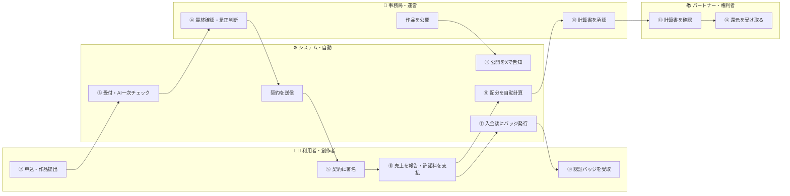
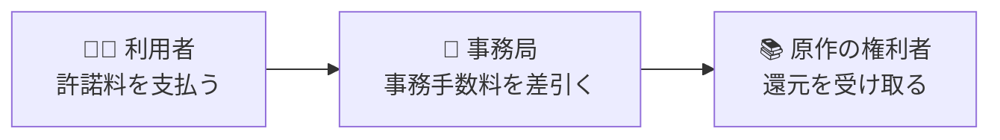

# SPLL 役割で見る全体像（かんたん説明資料）

**版** v0.1 / **ねらい** 仕組みを「**誰が・何をするか**」だけでざっくり理解する

> 本資料は関係者向けの概要説明用に、業務フローを**デフォルメ**（簡略化）し、**役割**を中心にまとめたものです。
> 台帳名・API・ステータス等の詳細は「**業務フロー確認資料（詳細版）**」を参照してください。

---

## 1. 登場する4つの役割

| 役割 | ひとことで | 主にやること |
|---|---|---|
| 🧑‍🎨 **利用者（創作者）** | 二次創作を作って頒布する人 | 申込・作品提出・売上報告・許諾料の支払 |
| ⚙️ **システム（自動）** | 受付と一次チェックの自動化 | 申込受付・AI一次チェック・契約送信・配分の自動計算 |
| 🏢 **事務局（運営）** | 人の目で確認・判断する | 最終確認・是正判断・契約/入金の管理・計算書の承認 |
| 📚 **パートナー（権利者）** | 原作の権利をもつ人 | 計算書の確認・配分（還元）の受取 |

> ポイント：面倒な受付・チェック・計算は**システム**が自動でさばき、大事な最終判断とお金まわりは**事務局**（人の判断）が担います。

---

## 2. 役割スイムレーン（1枚でざっくり）

> 番号（①→⑫）が仕事の流れ順です。矢印が**別の役割へのバトンタッチ**を表します。
> **★追加業務**：① 公開を**Xで告知**、⑦⑧ 入金後に**認証バッジ（クレジット表記）を発行・配布**。

---

## 3. 3ステップでわかる流れ

| ステップ | ざっくり内容 | 主役 |
|---|---|---|
| **★ 公開 → 告知** | 作品を公開したら**Xで自動告知**（集客） | 事務局・システム |
| **① 申込 → 審査 → 契約** | 作品を出して申込 → チェックを通ったら電子契約 | 利用者・システム・事務局 |
| **② 提出 → 確認** | 作品を提出 → AIが一次チェック → 人が最終確認・必要なら是正依頼 | 利用者・システム・事務局 |
| **③ 報告 → 入金 → バッジ** | 売上を報告・許諾料を入金 → **認証バッジ（PNG3サイズ）を発行・配布** | 利用者・事務局・システム |
| **④ 精算 → 還元** | 半期でまとめて計算 → 原作の権利者へ配分 | 事務局・パートナー |

---

## 4. お金（還元）の流れ

> 支払われた許諾料から**事務手数料を除いた額**が、**原作の権利者（パートナー）へ還元**されます。

---

## 5. おさえておきたいポイント

- **AIの判定は“目安”**。合否や保証ではなく、**最終判断は必ず人**が行います（事務局）。
- **原作者への還元を大切に**。一度発生した配分は、簡単には取り消しません。
- **むずかしい入口をやさしく**。利用者はログイン不要の専用リンクで報告でき、手続きの負担を減らします。
- **記録はすべて残る**。誰が・いつ・何をしたかを記録し、あとから確認できます。

---

> 本資料は概要説明用のドラフト（v0.1）です。数値・条件・名称は確定前で、すり合わせ結果を反映して更新します。
