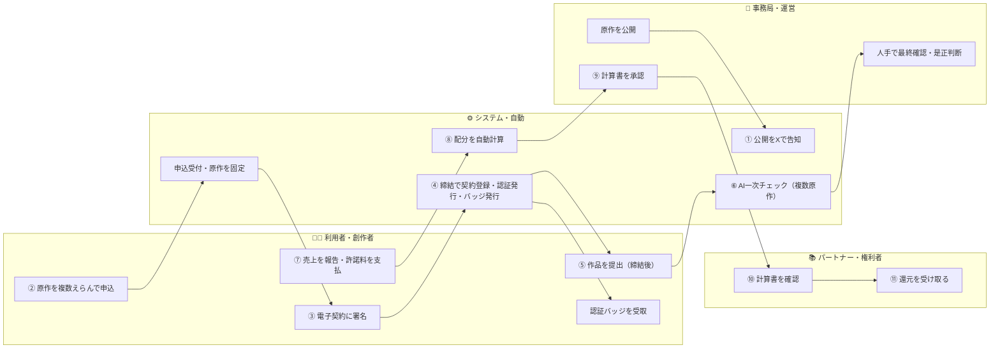
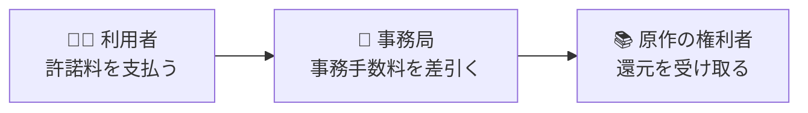

# SPLL 役割で見る全体像（かんたん説明資料）

**版** v0.3 / **ねらい** 仕組みを「**誰が・何をするか**」だけでざっくり理解する

> 本資料は関係者向けの概要説明用に、業務フローを**デフォルメ**（簡略化）し、**役割**を中心にまとめたものです。
> 台帳名・API・ステータス等の詳細は「**業務フロー確認資料（詳細版）**」を参照してください。
> **v0.3 更新点**：セキュリティ強化版（修正設計書v2.0）の実装完了を反映。システムを**3つの入口に分離**して構築済み
> （申込窓口／自動処理／管理コンソール）。認証の失効などの重要操作は**二人体制（申請→別担当者の承認）**に。
> **v0.2 更新点**：審査はすべて**契約締結後**に統一（B経路固定）。申込では**原作を複数選択**でき、作品提出は締結後に行います。

---

## 1. 登場する4つの役割

| 役割 | ひとことで | 主にやること |
|---|---|---|
| 🧑‍🎨 **利用者（創作者）** | 二次創作を作って頒布する人 | 原作の選択・申込・契約締結・作品提出・売上報告・許諾料の支払 |
| ⚙️ **システム（自動）** | 受付と一次チェックの自動化 | 申込受付・契約登録・認証発行・AI一次チェック・配分の自動計算 |
| 🏢 **事務局（運営）** | 人の目で確認・判断する | 最終確認・是正判断・契約/入金の管理・計算書の承認 |
| 📚 **パートナー（権利者）** | 原作の権利をもつ人 | 計算書の確認・配分（還元）の受取 |

> ポイント：面倒な受付・チェック・計算は**システム**が自動でさばき、大事な最終判断とお金まわりは**事務局**（人の判断）が担います。

---

## 2. 役割スイムレーン（1枚でざっくり）

> 番号（①→⑪）が仕事の流れ順です。矢印が**別の役割へのバトンタッチ**を表します。
> **審査はすべて締結後**：申込時に作品は提出しません。締結後に専用ページから提出し、AI一次チェック→人手確認に進みます。
> **★追加業務**：① 公開を**Xで告知**（送信は承認制）、④ **締結と同時に認証バッジ**（クレジット表記・PNG3サイズ）を発行・配布。

---

## 3. ステップでわかる流れ

| ステップ | ざっくり内容 | 主役 |
|---|---|---|
| **★ 公開 → 告知** | 原作を更新したら**Xで告知**（送信は承認ポップアップで確認） | 事務局・システム |
| **① 原作選択 → 申込** | 利用する原作を**複数えらび**、同意して申込（作品提出はまだ） | 利用者・システム |
| **② 契約締結** | クラウドサインフォーム→CloudSignで電子契約に署名。**締結で認証・バッジを発行** | 利用者・システム |
| **③ 提出 → 確認** | 締結後に作品を提出 → AIが複数原作を一次チェック → 人が最終確認・必要なら是正依頼 | 利用者・システム・事務局 |
| **④ 報告 → 入金** | 売上を報告・許諾料を入金 | 利用者・事務局 |
| **⑤ 精算 → 還元** | 半期でまとめて計算 → 原作の権利者へ配分 | 事務局・パートナー |

---

## 4. お金（還元）の流れ

> 支払われた許諾料から**事務手数料を除いた額**が、**原作の権利者（パートナー）へ還元**されます。
> 複数の原作を1つの契約で許諾した場合は、対象原作の権利者へ配分します。

---

## 5. おさえておきたいポイント

- **審査は締結後に統一**。申込＝契約の入口、提出＝締結後、という流れに一本化しました（旧A経路は廃止）。
- **原作は複数まとめて**。1つの二次創作物が複数の原作を使う場合も、1つの契約で包括的に許諾します。
- **AIの判定は“目安”**。合否や保証ではなく、**最終判断は必ず人**が行います（事務局）。AIが止まっても提出は消えず、人手審査に回ります。
- **原作者への還元を大切に**。一度発生した配分は、簡単には取り消しません。還元の計算は**契約した時点の条件**で固定されます。
- **当社はメールアドレスを管理しない**。申込〜締結はクラウドサインフォーム側で完結し、認証やバッジは**認証URL（QR）**と**提出リンク**で受け渡します。
- **記録はすべて残る**。誰が・いつ・何をしたかを記録し、あとから確認できます。

---

## 6. 安心して使える仕組み（セキュリティ強化・実装済み）

| 仕組み | ひとことで |
|---|---|
| **入口を3つに分離** | 「申込窓口（誰でも）」「自動処理（システム専用）」「管理コンソール（事務局限定）」を**別々のシステム**として構築。外から管理機能に触れない |
| **役割ごとの権限** | 管理操作は登録された担当者だけ。役割（システム管理／法務／運営／経理／監査）ごとにできることを制限 |
| **重要操作は二人体制** | 認証の失効・再有効化などは**申請→別の担当者が承認**して初めて実行（誤操作・不正の防止） |
| **バッジは本人にだけ配布** | 共有リンクを使わず、本人確認（トークン）を通った人にだけシステムが直接渡す |
| **同意の証拠を保存** | 「どの版の同意文に・いつ・何に同意したか」を記録。文面を更新したら再同意を求める |
| **お金の動きを厳密に** | 一部入金・過入金を自動検出。入金取消には理由が必須。計算書の二重送信を防止 |
| **期限の見張り番** | 審査の遅れ・売上報告の出し忘れをシステムが検知して事務局に知らせる |

---

> 本資料は概要説明用のドラフト（v0.3）です。数値・条件・名称は確定前で、すり合わせ結果を反映して更新します。
