# SPLL 操作マニュアル v1.0

TRPG二次創作 利用許諾プラットフォーム（SPLL）の画面遷移と操作方法をまとめたものです。
掲載している画面は、実際に配信しているHTML（Cloud Run の公開サイト／GASの各ウェブアプリ）を
そのまま表示して撮影したものです。表示されている番号・氏名・作品名はすべてサンプルです。

- 対象読者：**クリエーター**（申込者）向けの案内を作る方、**ユーザー**（事務局担当者）
- 関連文書：`docs/SPLL_初期設定チェックリスト_v1.0.md`（設定）／`docs/SPLL_手動テスト手順_v1.0.md`（検証）

---

## 0. システムの構成と入口

| # | 画面 | 置き場所 | 誰が使うか | アクセス方法 |
|---|---|---|---|---|
| ① | 申込窓口（公開サイト） | Cloud Run | クリエーター | 公開URL（誰でも） |
| ② | 手続き案内ページ／作品提出ページ／認証バッジ／検証ページ | GAS②（Cloud Run経由で配信） | クリエーター | **専用リンク**（トークン付きURL） |
| ③ | 管理コンソール | GAS③ | ユーザー（事務局） | 社内Googleアカウントでログイン |

**用語**

| 用語 | 意味 |
|---|---|
| クリエーター | 二次創作の頒布を申し込む方（申請者） |
| ユーザー | 事務局の担当者（このシステムを運用する側） |
| SPLL番号 | 案件の通し番号。申込〜契約〜審査〜認証まで、この1つの番号で追跡します |
| 認証バッジ | 正規ライセンスであることを示すPNG画像。検証用QRコードが入っています |

---

## 1. 全体の流れ

申込から頒布までは**10のステップ**です。上から順に進み、途中で戻るのは「是正のお願い」のときだけです。

| # | 誰が | すること | 起きること |
|---|---|---|---|
| 1 | クリエーター | 原作と利用目的をえらび、同意して申し込む | **SPLL番号が発行される**（→ 2.1〜2.3） |
| 2 | クリエーター | クラウドサインフォームで契約者情報を入力する | 氏名・住所・連絡先だけ。**条件は自動で引き継がれる** |
| 3 | システム | 入力内容をもとに、クラウドサインへ契約書を送信する | 個別確認が必要な申込だけ事務局が手動対応 |
| **4** | **クリエーター** | **契約書に合意する** | **★ここが契約の成立時点。** 手続き案内ページを発行<br>✉ **締結直後のご案内メール**（5分以内） |
| 5 | クリエーター | 完成した作品を提出する | 20MB超は専用フォルダから（→ 2.6） |
| 6 | システム | AIが一次審査をする（Vertex AI Gemini） | PASS候補／要確認／高リスク候補に振り分け。**下読みであり承認ではない** |
| 7 | **事務局（ユーザー）** | 作品審査で最終判断をする | 承認／是正のお願い／上申（→ 3.4）<br>↩ 是正のときは修正版を再提出して**ステップ5へ戻る** |
| **8** | **システム** | **承認されると認証と認証バッジが発行される** | **★締結しただけでは発行されない。**<br>✉ **審査完了のご連絡** ＋ ✉ **バッジ発行のご連絡** |
| 9 | クリエーター | バッジをダウンロードして頒布物に掲載する | 大・中・小の3サイズ（→ 2.7） |
| 10 | 第三者 | QRコードを読み取る | 検証ページに「確認済み」（→ 2.8） |

> **このあと、事務局が認証を止めることがあります。** 利用許諾料の入金が確認できないときなど、
> 管理コンソールから認証を停止すると、**QRの検証が「有効ではありません」に変わり、バッジも取得できなくなります**。
> 入金を確認したら復帰させます（→ 3.5）。

---

## 2. クリエーター側の画面遷移

### 2.1 トップページ

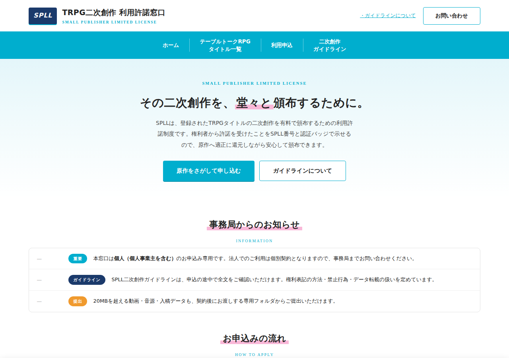

公開サイトの入口です。「原作をさがして申し込む」から申込に進みます。
ヘッダーの「お問い合わせ」は事務局の連絡先（`OFFICE_CONTACT`）に繋がります。

ページ下部には**二次創作ガイドラインの全文**を置いています。管理コンソールで公開した版がそのまま表示されます。

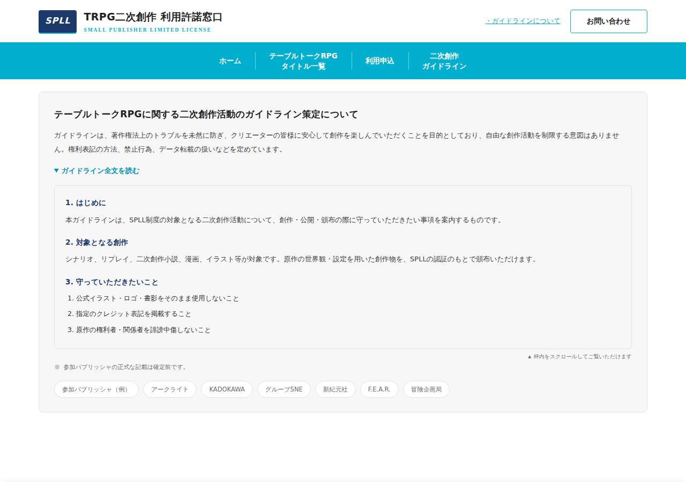

### 2.2 原作をさがす

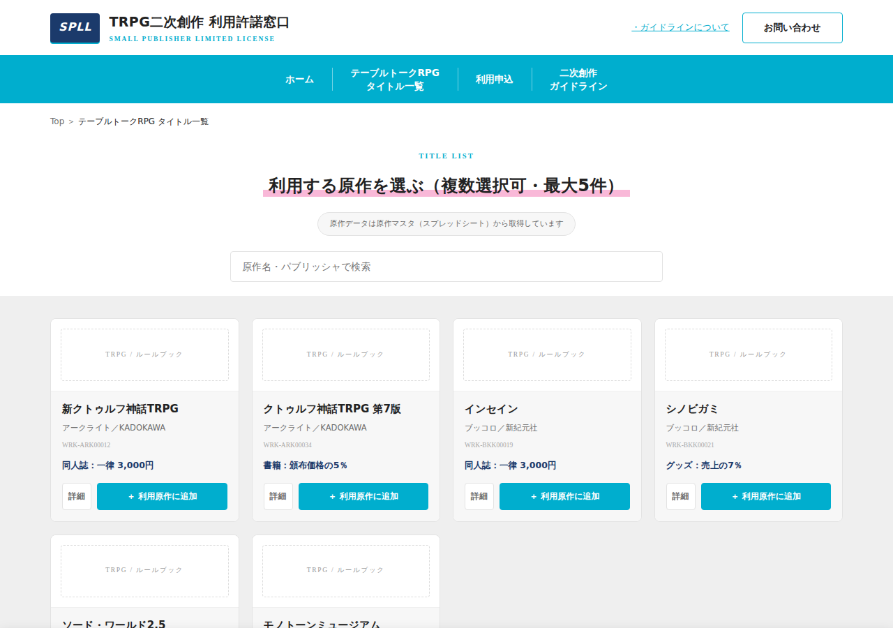

管理コンソールで「公開（PUBLISHED）」にした原作だけが並びます。原作名・パブリッシャで絞り込めます。

- **詳細** … 利用できる要素／できない要素、クレジット表記、利用料を確認できます
- **＋ 利用原作に追加** … 申込に含めます（**複数選択可・既定は最大5件**）

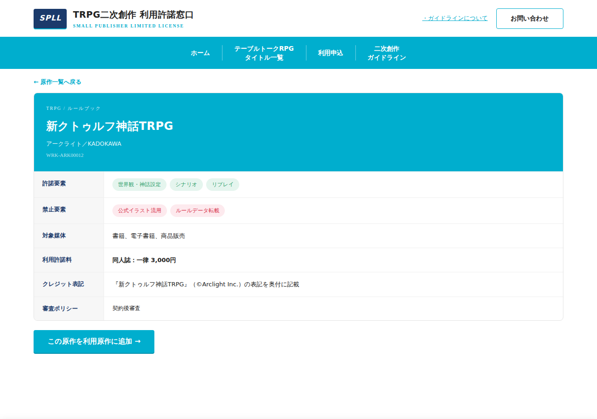

原作を追加すると、画面下部に選択中の原作が表示されます。

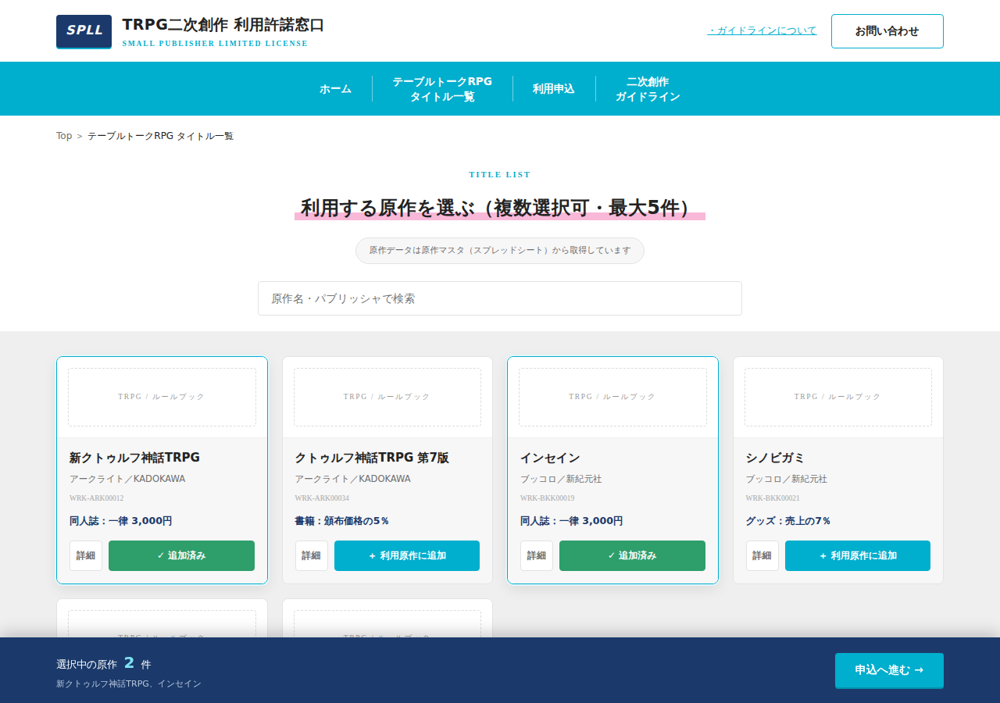

> **原作情報が取得できないときは申込を止めます。** 「現在申込を受け付けられません」と表示され、
> サンプルデータで申込が進むことはありません（誤った条件で契約書が作られるのを防ぐため）。

### 2.3 申込ウィザード（全4ステップ）

画面上部のステッパーは6段階を示していますが、**このサイトで操作するのは1〜4**です。
5（契約者情報の入力）はクラウドサインフォーム、6（契約の締結）はクラウドサインで行います。

#### ステップ1　選択内容の確認・利用目的

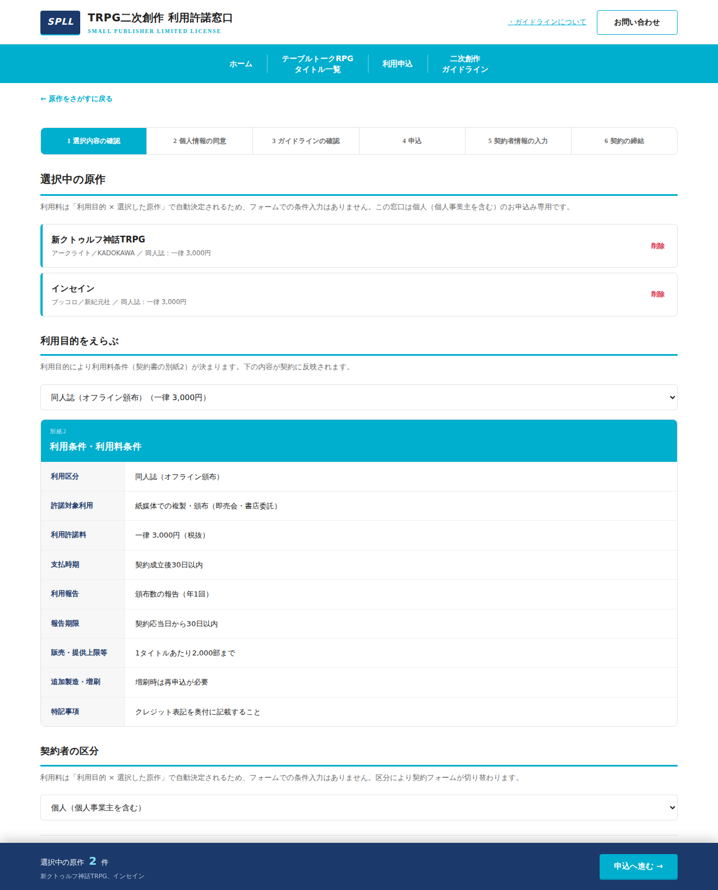

利用目的を選ぶと、**契約書の別紙2（利用条件・利用料条件）がその場で表示**されます。
利用料は「利用目的 × 選択した原作」で自動的に決まるため、クリエーターが金額を入力する箇所はありません。

契約者の区分で「法人」を選ぶと申込には進めず、法人向けの問い合わせ先を案内します（この窓口は個人専用です）。

#### ステップ2　個人情報の取得についての同意

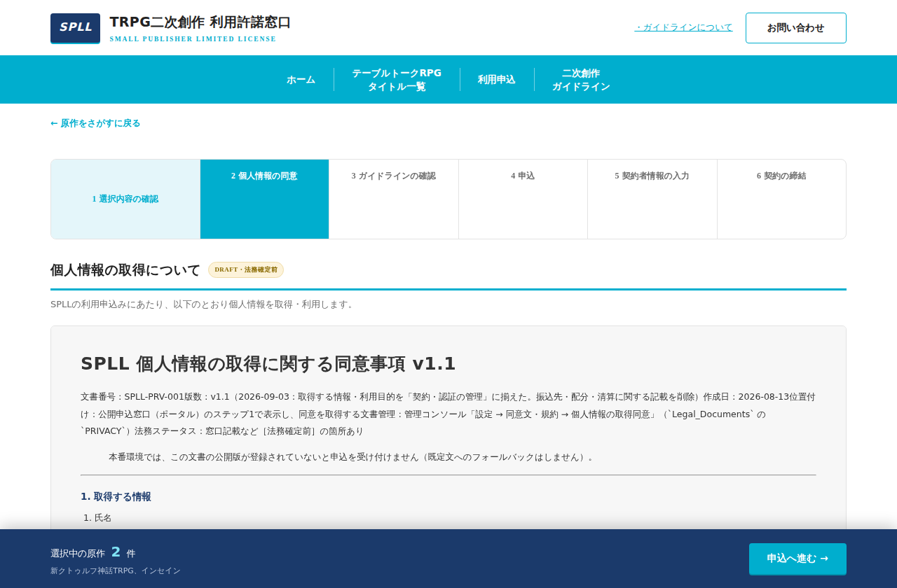

管理コンソールで公開した「個人情報の取得について」の全文が表示されます。
チェックを入れないと次へ進めません。**同意した版番号とハッシュが証跡として記録されます。**

#### ステップ3　ガイドライン・利用規約の確認

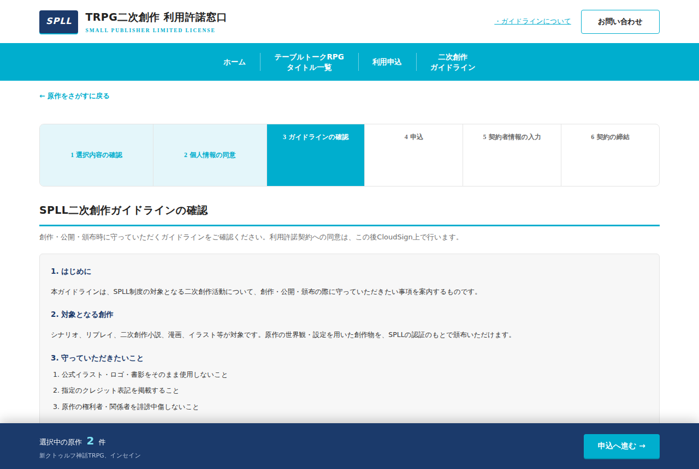

利用規約と、選択した原作の条件（別紙1・別紙2に相当する内容）が表示されます。

#### ステップ4　申込

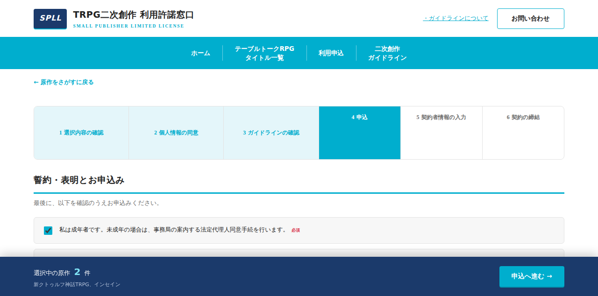

最終確認のチェックをすべて入れると「申込を作成してクラウドサインへ進む」が押せます。

#### 申込完了

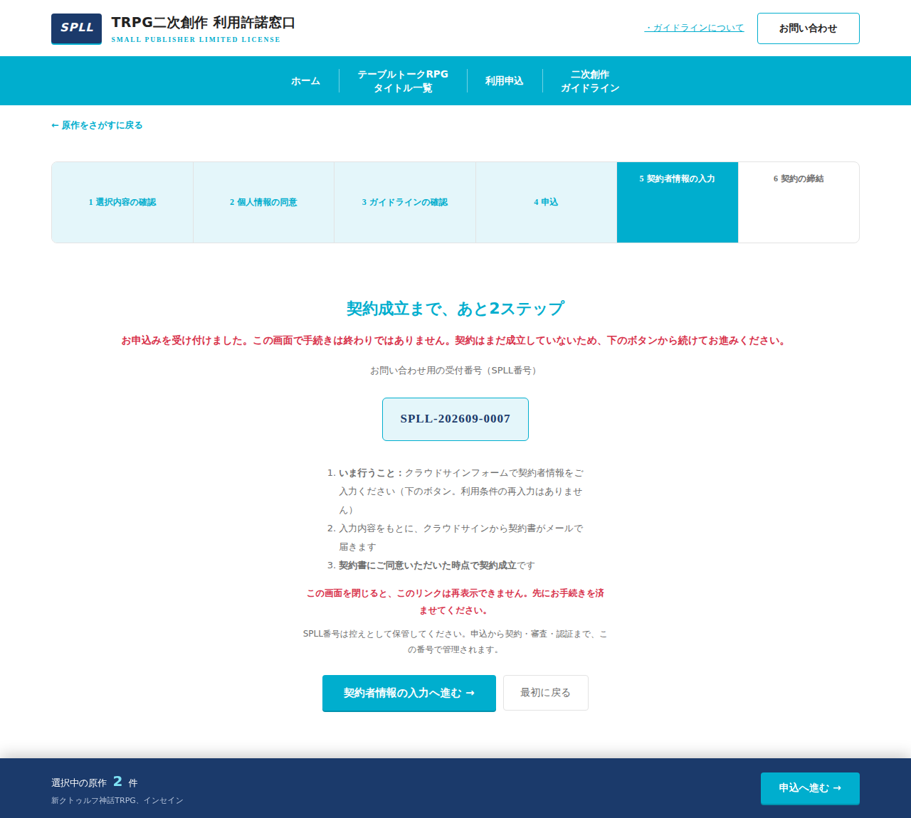

**SPLL番号が発行されます。**この画面は「手続きが終わった」画面ではなく、
**契約成立まであと2ステップ**であることを明示しています。

1. 「契約者情報の入力へ進む →」からクラウドサインフォームで契約者情報を入力（利用条件の再入力はありません）
2. クラウドサインから届く契約書に合意 → **この時点で契約成立**

ステッパーも1〜4が完了し、現在地が「5 契約者情報の入力」に進みます。
**この画面を閉じるとフォームのリンクは再表示できない**ため、その旨を画面上でも案内しています。

> 利用条件・SPLL番号・対象原作は、フォームの**hidden項目**として自動的に引き継がれます。
> クリエーターが入力するのは氏名・住所・連絡先などの契約者情報だけです。

### 2.4 契約成立後に届くメール

締結の受信から**5分以内**に、クラウドサインの送付先へ自動送信されます（→ §4.1）。
本文には**手続き案内ページのリンク**だけが入ります。**口座情報は書きません**（振込先は契約書にのみ記載）。

### 2.5 手続き案内ページ

メールのリンクから開きます。**契約者が長期間ブックマークして使う1枚**です（既定の有効期限400日）。

#### 審査前（作品を提出する前）

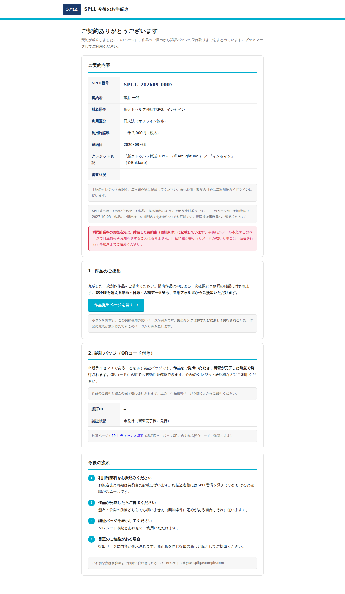

- ご契約内容（SPLL番号・対象原作・利用許諾料・締結日・**クレジット表記**・審査状況）
- 1. 作品のご提出 → 「作品提出ページを開く」
- 2. 認証バッジ → **「作品の審査完了後に発行されます」**と表示（この時点では取得できません）
- 今後の流れ

> **「作品提出ページを開く」は押すたびに新しい提出リンクを発行します。**
> 締結時から提出リンクを開けっ放しにしないための仕組みで、作品の完成が数ヶ月先でもこのページから開き直せます。

#### 審査完了後（バッジ発行済み）

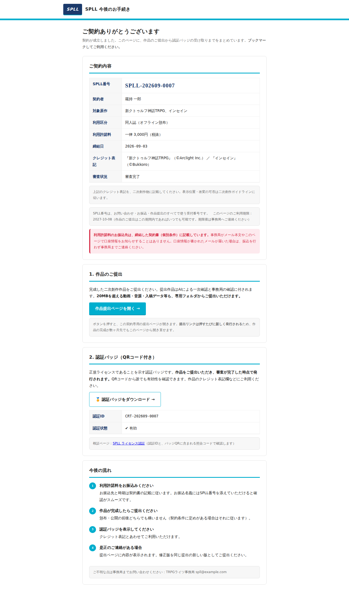

審査状況が「審査完了」になり、**「認証バッジをダウンロード」**ボタンと認証ID・認証状態が表示されます。

### 2.6 作品提出ページ

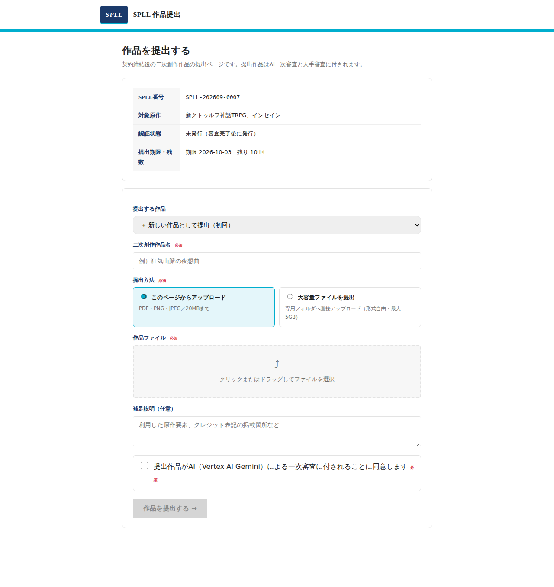

- **このページからアップロード** … PDF・PNG・JPEG／既定20MBまで（管理コンソールで変更可）
- **大容量ファイルを提出** … 専用のDriveフォルダへ直接アップロード（形式自由・既定5GB／50ファイル）。
  投入後に「提出を確定する」を押すと受領され、フォルダの共有は自動的に解除されます
- AI（Vertex AI Gemini）による一次審査に付されることへの同意チェックが必須です

**1つのSPLL番号で提出できる作品は1つ**です。修正版は「同じ作品の新しい版」として再提出します。

#### 是正のお願いを受け取ったとき

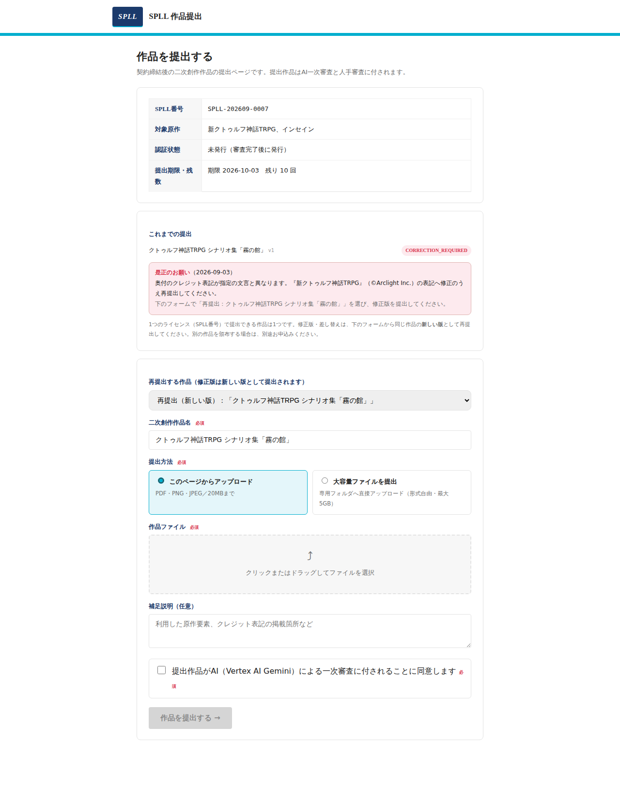

事務局が是正を求めると、**その内容がこのページに表示**されます。
フォームで「再提出（新しい版）」を選び、修正版を提出してください。

#### 審査完了後

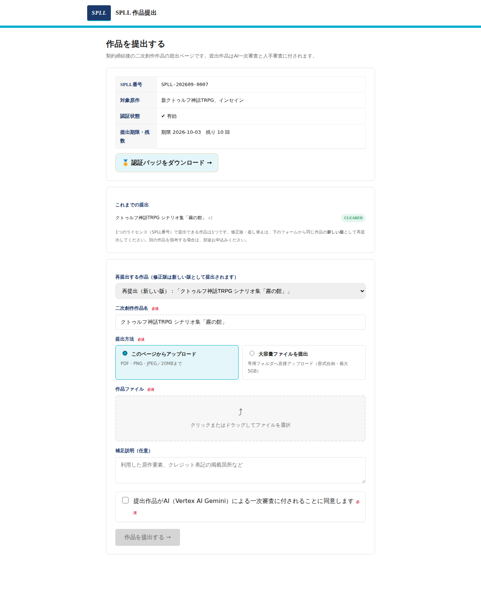

提出履歴の状態が「CLEARED」になり、このページからも認証バッジを取得できます。

### 2.7 認証バッジのダウンロード

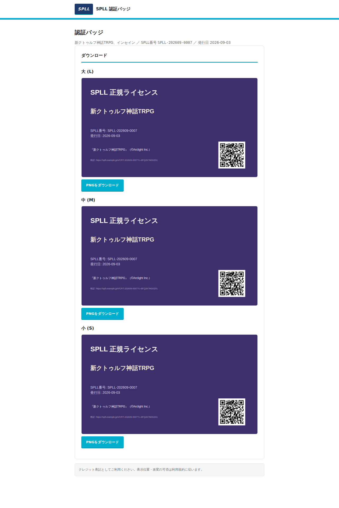

大（L）・中（M）・小（S）の3サイズが用意され、それぞれPNGでダウンロードできます。

バッジには **SPLL番号・発行日・クレジット表記・検証用QRコード** が入ります。

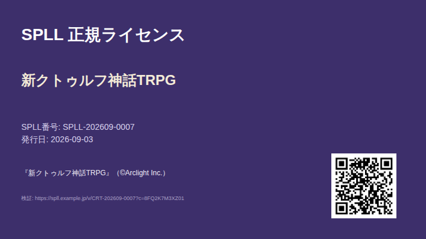

> **バッジは認証が有効（ACTIVE）のときだけ取得できます。**
> 事務局が認証を停止している間、失効・契約終了の後は、ダウンロード導線が出ません。

### 2.8 QRコードから開く検証ページ

頒布物のQRを読み取った第三者（イベント主催者・書店・購入者など）が開く画面です。

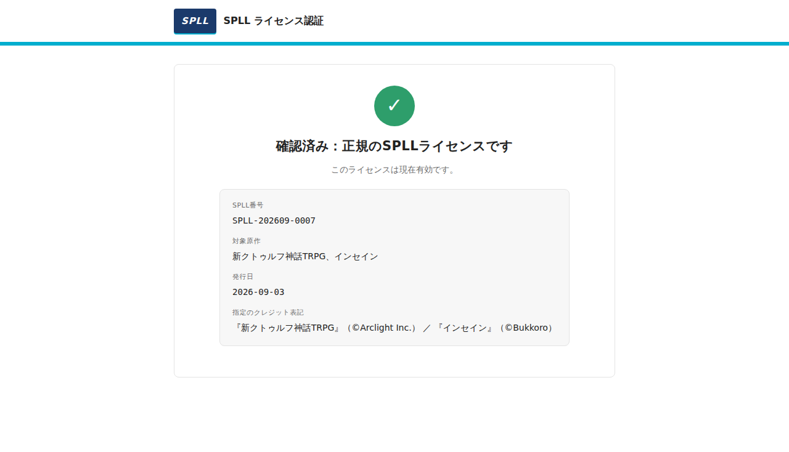

SPLL番号・対象原作・発行日・指定のクレジット表記が表示されます。

認証が停止・失効している場合は「有効ではありません」と表示します。**理由は表示しません**
（掲載者以外に事情を推測させないため）。認証IDと照合コードを直接入力して確認することもできます。

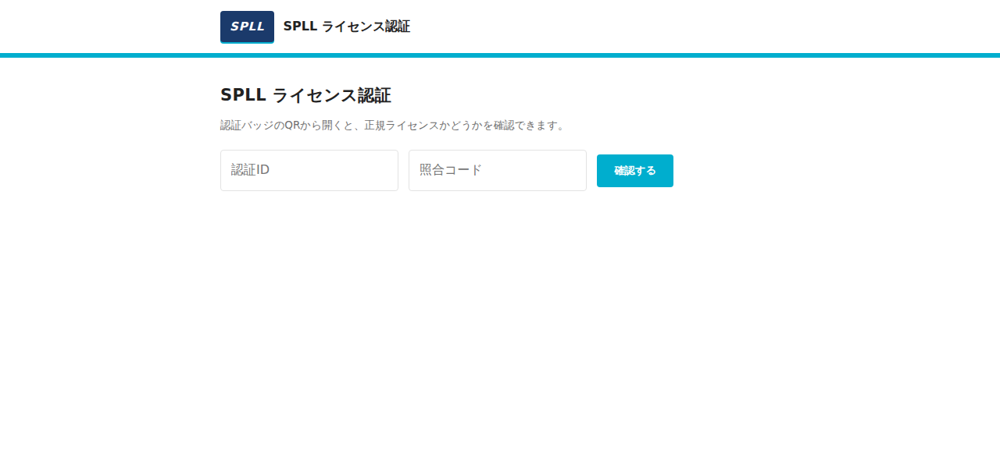

---

## 3. ユーザー（事務局）側の画面遷移と操作

管理コンソールは**社内Googleアカウントでのログインが必須**です（匿名アクセス不可）。
権限（ロール）によって操作できる範囲が変わります。

| ロール | できること |
|---|---|
| SYSTEM_ADMIN | すべて（外部API・管理者の登録を含む） |
| LEGAL_ADMIN | 法務文書の公開、審査、認証の状態変更 |
| OPERATIONS | 日常運用（審査、案内リンク発行、設定の一部） |
| REVIEWER | 作品審査の判断のみ |

### 3.1 ダッシュボード

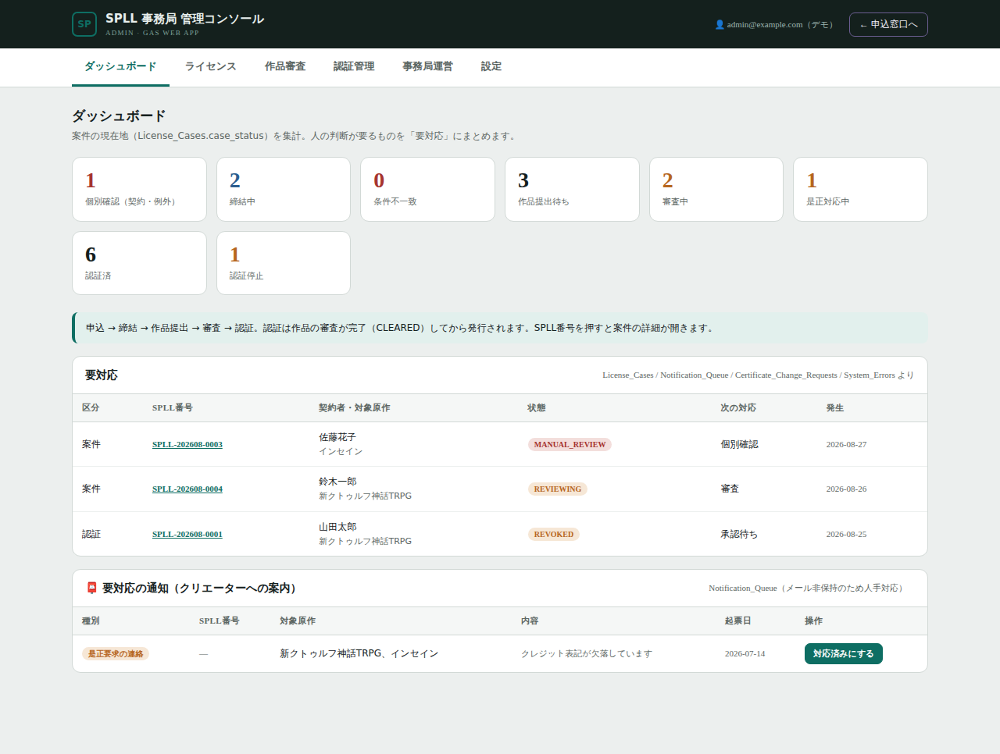

案件の現在地を集計し、**人の判断が要るものだけ**を「要対応」にまとめています。

- 上段のKPI … 個別確認／締結中／条件不一致／作品提出待ち／審査中／是正対応中／認証済／認証停止
- **要対応** … 個別確認が必要な案件、審査待ち、認証の状態変更申請など。SPLL番号を押すと詳細が開きます
- **要対応の通知** … 自動送信の対象外・送信に失敗した連絡（→ §4.4）

### 3.2 ライセンス一覧

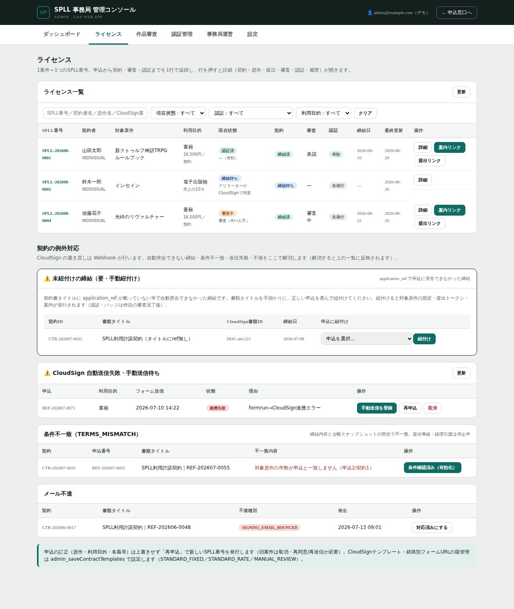

**1案件＝1つのSPLL番号**。申込から契約・審査・認証までを1行で追跡します。
SPLL番号・契約者名・原作名・クラウドサイン書類IDで検索でき、現在状態で絞り込めます。

下部には「契約の例外対応」（未紐付けの締結、条件不一致、メール不達）が並びます。

### 3.3 ライセンス詳細

行を押すと右から詳細が開きます。

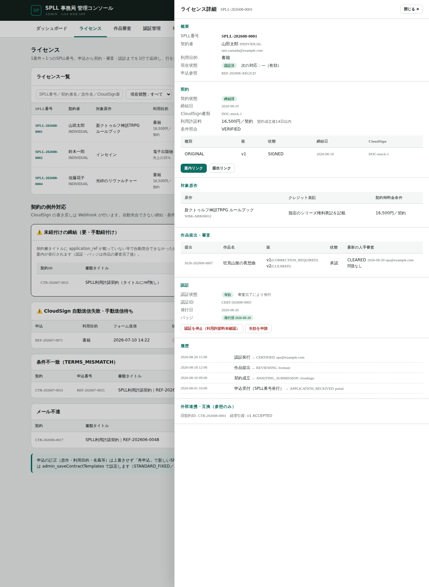

| セクション | 内容 |
|---|---|
| 概要 | SPLL番号・契約者・利用目的・現在状態・申込参照番号 |
| 契約 | 締結日・クラウドサイン書類・利用許諾料・条件照合の結果・契約の版 |
| 対象原作 | 原作ごとのクレジット表記と契約時の料金条件 |
| 作品提出・審査 | 提出と版の履歴、最新の人手審査の結果とコメント |
| 認証 | 認証状態・認証ID・発行日・バッジの状態 |
| 履歴 | 申込受付→契約成立→作品提出→審査→認証発行の時系列 |

**この画面からの操作**

| ボタン | 動作 | 注意 |
|---|---|---|
| 案内リンク | 手続き案内ページのURLを再発行 | **以前のURLは無効になります** |
| 提出リンク | 作品提出ページのURLを発行 | 以前の提出リンクは失効します |
| 認証を停止（利用許諾料未確認） | 認証を SUSPENDED にする | 理由の入力が必須。QR検証は「有効でない」表示になります |
| 失効を申請 | 認証の失効を申請する | 重大な状態変更は申請 → 承認の2段階です |

### 3.4 作品審査

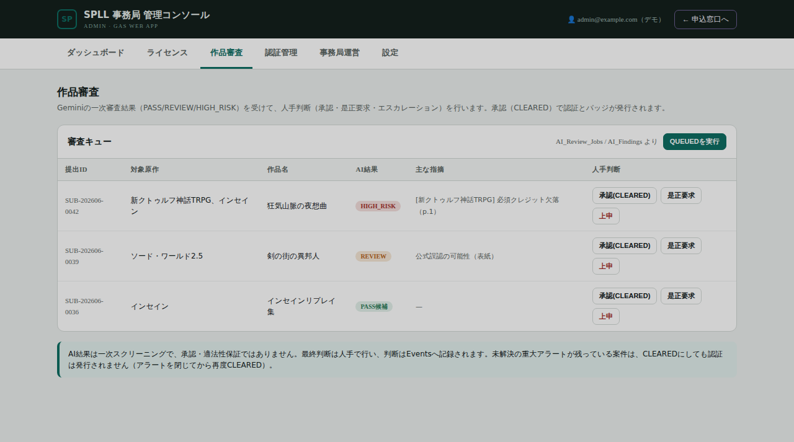

AIの一次審査結果（PASS / REVIEW / HIGH_RISK）を受けて、**人が最終判断**をします。

提出を選び、次のいずれかを記録します。

| 判断 | 意味 | 起きること |
|---|---|---|
| **承認（CLEARED）** | 適合 | 認証を発行 → 認証バッジを生成 → ✉ 審査完了・バッジ発行のメール |
| **是正要求（CORRECTION_REQUIRED）** | 修正が必要 | 提出ページに是正内容を表示。**コメント必須** |
| **上申（ESCALATED）** | 社内で判断が要る | 要対応に残す。**クリエーターへの自動送信はしません** |

提出IDの行からライセンス詳細を開けば、契約条件・クレジット表記・過去の版と突き合わせながら判断できます。

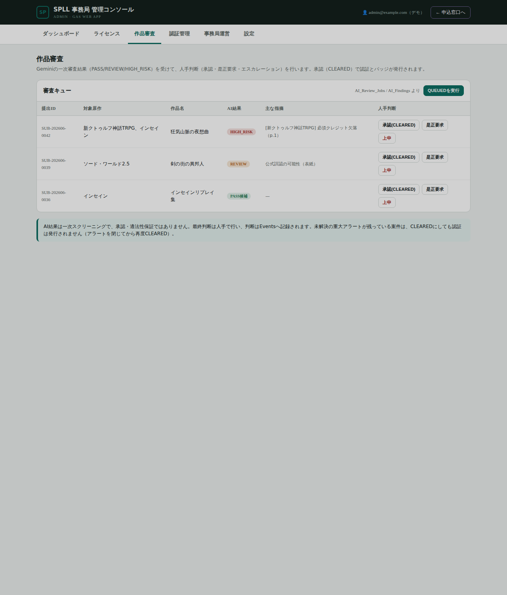

> **AIの結果は一次スクリーニングであり、承認でも適法性の保証でもありません。**
> 未解決の重大アラート（HIGH_RISK）が残っている案件は、承認しても認証が発行されません
> （アラートを閉じてから、あらためて承認してください）。
>
> 是正要求・上申は**コメント（理由）が必須**です。また、**最新版に対してのみ**判断できます
> （判断中に新しい版が提出された場合はエラーになります）。

### 3.5 認証管理

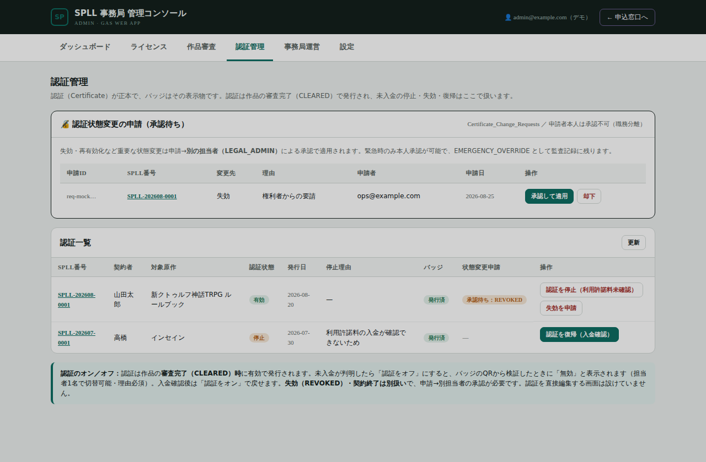

発行済みの認証を一覧し、状態を管理します。**認証（Certificate）が正本で、バッジはその表示物**です。

| 操作 | 用途 |
|---|---|
| 認証を停止（利用許諾料未確認） | 入金が確認できないときなど。**担当者1名で切替可・理由必須**。停止中はQR検証が「有効でない」になり、バッジも取得できません |
| 認証を復帰（入金確認） | 停止を解除して有効に戻します |
| 失効を申請 → 承認して適用／却下 | 失効・契約終了などの重大な変更。**申請者本人は承認できません**（職務分離）。緊急時のみ本人承認が可能で、監査記録に `EMERGENCY_OVERRIDE` として残ります |

> 認証を直接編集する画面は設けていません。状態はこの画面の操作か、審査の結果としてのみ変わります。
>
> **バッジ生成に失敗した案件**は、ライセンス詳細のバッジ欄にある「再試行」から作り直します。

### 3.6 事務局運営

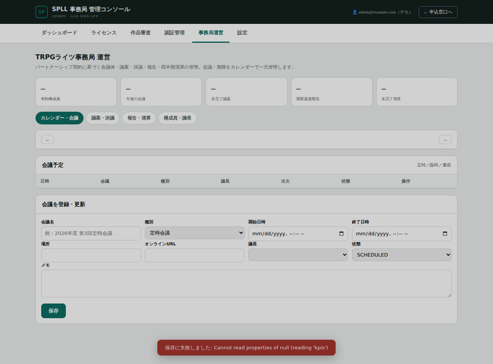

パートナー（権利者）とのやりとり、権利者別の実績など、日常運用の画面です。

### 3.7 設定

#### 手続き案内・自動メール

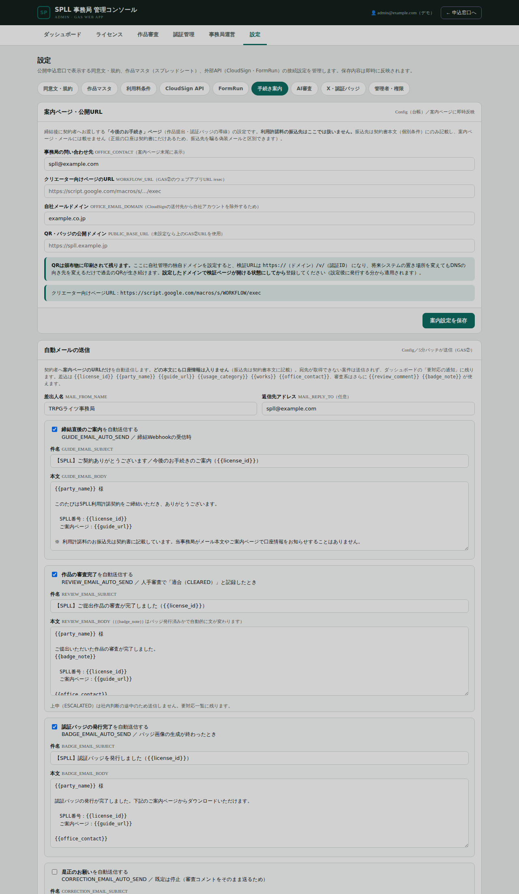

- 事務局の問い合わせ先、クリエーター向けページのURL、QR・バッジの公開ドメイン
- **自動メールの送信**（4種類。それぞれ 送る／送らない・件名・本文を編集できます）
- 種類を選んだ**テスト送信**、種類ごとの送信状況（送信済・待ち・失敗）

> **利用許諾料の振込先はここでは扱いません。** 振込先は契約書本文（個別条件）にのみ記載し、
> 案内ページ・メールには載せません。正規の口座が契約書にしかないため、
> 振込先を騙る偽装メールと区別できます。

#### AI一次審査

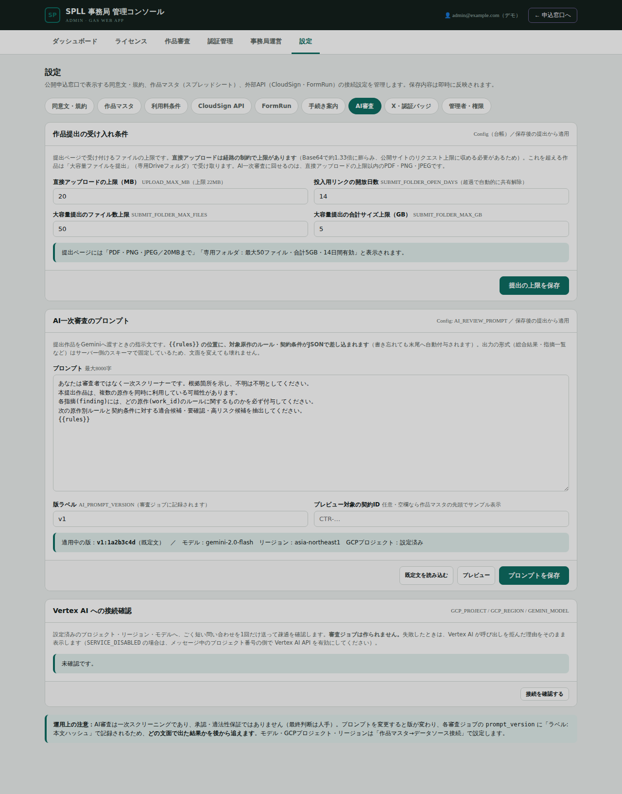

- **作品提出の受け入れ条件** … 直接アップロードの上限（既定20MB・上限22MB）、大容量提出の上限
- **AI一次審査のプロンプト** … `{{rules}}` の位置に対象原作のルールと契約条件がJSONで差し込まれます。
  出力形式はサーバー側で固定しているため、文面を変えても壊れません
- **Vertex AI への接続確認** … 審査ジョブを作らずに疎通だけを確認します

#### 同意文・規約

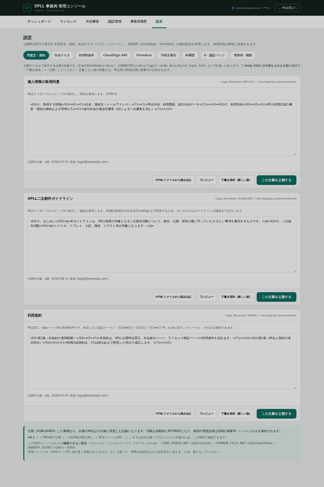

「個人情報の取得について」「二次創作ガイドライン」「利用規約」を編集し、公開します。
**公開した瞬間から、以後の申込はその版に同意した記録**になります。旧版は自動的にRETIREDとなり、
既存の同意証跡は当時の版番号・ハッシュのまま保持されます。

#### 申込導線・クラウドサインフォーム連携

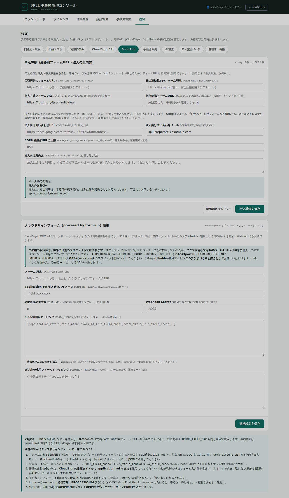

経路別のフォームURL（定額用・売上連動用）、法人の案内先、hidden項目のマッピングを扱います。

> hidden項目マッピングなど一部の設定は**プロジェクトごとのスクリプト プロパティ**で、
> この画面から保存してもGAS①・GAS②へは届きません（画面上に注記があります）。

#### 作品マスタ

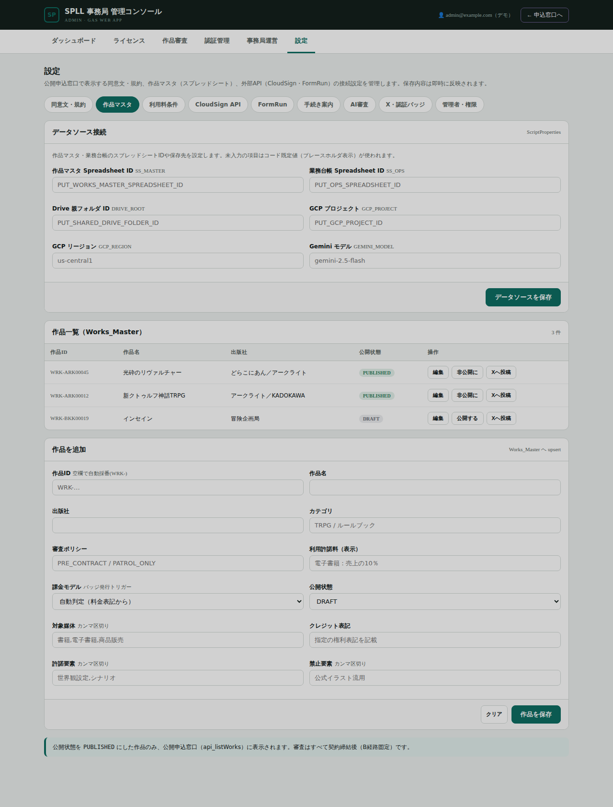

原作の登録・公開状態の切り替え。**公開（PUBLISHED）にした原作だけ**が申込窓口に並びます。

#### 管理者・権限

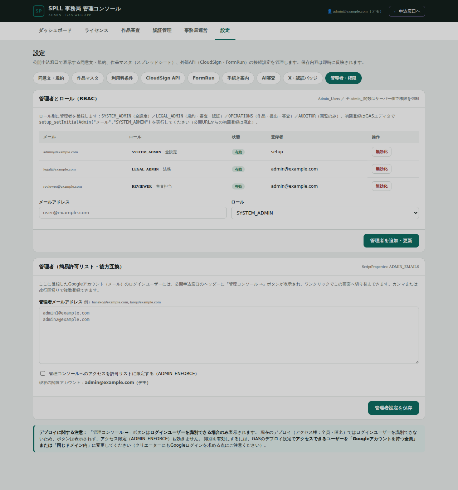

管理コンソールを使えるアカウントとロールを登録します。

---

## 4. 自動送信されるメール

送信は**GAS②の5分バッチ**が行います。締結や審査の処理の中では送らないため、
メール障害で業務処理そのものが失敗することはありません。
差出人名・返信先は4種類で共通です（`MAIL_FROM_NAME` / `MAIL_REPLY_TO`）。

| 場面 | 起票される瞬間 | 既定 |
|---|---|---|
| 締結直後のご案内 | 締結の受信後 | 送る |
| 作品の審査完了 | 審査で「承認（CLEARED）」を記録したとき | 送る |
| 認証バッジの発行完了 | バッジ画像の生成が終わったとき | 送る |
| 是正のお願い | 「是正要求」を記録したとき | **送らない** |

**案内ページのリンクは1本に保ちます。** 審査完了・バッジ発行のメールにも、締結時に届いたものと
同じURLを載せます（契約者がブックマークしているリンクがそのまま使えます）。

差込：`{{license_id}}` `{{party_name}}` `{{guide_url}}` `{{usage_category}}` `{{works}}` `{{office_contact}}`
審査系はさらに `{{review_comment}}`（審査コメント）／`{{badge_note}}`（バッジ発行済みかで文が変わります）。

### 4.1 締結直後のご案内

> **件名：**【SPLL】ご契約ありがとうございます／今後のお手続きのご案内（SPLL-202609-0007）

```
蔵持 一郎 様

このたびはSPLL利用許諾契約をご締結いただき、ありがとうございます。
お客様のSPLL番号と、今後のお手続き（作品のご提出・審査完了後の認証バッジの受け取り）を
下記のご案内ページにまとめております。ブックマークのうえご利用ください。

　SPLL番号：SPLL-202609-0007
　ご案内ページ：https://…/?page=guide&t=…

※ 利用許諾料のお振込先は契約書（個別条件）に記載しています。当事務局がメール本文やご案内ページで口座情報をお知らせすることはありません。
　 口座情報が書かれたメールを受け取られた場合は、内容を実行せず事務局までご連絡ください。

TRPGライツ事務局 spll@example.com
```

### 4.2 作品の審査完了

> **件名：**【SPLL】ご提出作品の審査が完了しました（SPLL-202609-0007）

```
蔵持 一郎 様

ご提出いただいた作品の審査が完了しました。
認証バッジの発行手続きに進みますので、しばらくお待ちください。発行が完了しましたら、あらためてメールでご連絡いたします。

　SPLL番号：SPLL-202609-0007
　対象原作：新クトゥルフ神話TRPG、インセイン
　ご案内ページ：https://…/?page=guide&t=…

認証バッジの受け取り・今後のお手続きは、上記のご案内ページからご確認いただけます。

※ 当事務局がメールで口座情報をお知らせすることはありません（お振込先は契約書に記載しています）。

TRPGライツ事務局 spll@example.com
```

バッジが既に発行済みの場合、2行目は「**認証バッジも発行済みです。下記のご案内ページからダウンロードいただけます。**」に変わります。

### 4.3 認証バッジの発行完了

> **件名：**【SPLL】認証バッジを発行しました（SPLL-202609-0007）

```
蔵持 一郎 様

認証バッジの発行が完了しました。下記のご案内ページからダウンロードいただけます。

　SPLL番号：SPLL-202609-0007
　ご案内ページ：https://…/?page=guide&t=…

バッジにはSPLL番号と検証用のQRコードが入っています。
QRコードの読み取り先では、この認証が現在も有効であることを誰でも確認できます。
頒布物へ掲載される際は、画像を加工せずそのままご利用ください。

※ 当事務局がメールで口座情報をお知らせすることはありません（お振込先は契約書に記載しています）。

TRPGライツ事務局 spll@example.com
```

### 4.4 是正のお願い（既定は自動送信しない）

> **件名：**【SPLL】ご提出作品について確認のお願い（SPLL-202609-0007）

```
蔵持 一郎 様

ご提出いただいた作品について、下記の点をご確認ください。

　SPLL番号：SPLL-202609-0007
　対象原作：新クトゥルフ神話TRPG、インセイン

【確認をお願いする点】
奥付のクレジット表記が指定の文言と異なります。『新クトゥルフ神話TRPG』（©Arclight Inc.）の表記へ修正のうえ再提出してください。

ご修正のうえ、下記のご案内ページから作品を再度ご提出ください。
　ご案内ページ：https://…/?page=guide&t=…

ご不明な点がありましたら、このメールへご返信ください。

TRPGライツ事務局 spll@example.com
```

審査コメントをそのまま送る内容になるため、既定では自動送信しません。
ダッシュボードの「要対応の通知」に残るので、文面を確認してから連絡できます。
自動送信にしたい場合は、設定画面のチェックを入れてください。

### 4.5 送信されないときの扱い

| 状況 | 通知の状態 | 対応 |
|---|---|---|
| 連絡先メールが取得できていない | MANUAL_REQUIRED のまま | 要対応一覧から手動で案内 |
| 上申（ESCALATED） | MANUAL_REQUIRED のまま | 社内判断の後に連絡 |
| 送信に失敗 | 3回まで自動再試行 → SEND_FAILED | 要対応一覧に理由つきで残る |
| 1日の送信上限に到達 | MANUAL_REQUIRED のまま | 翌日のバッチが送信 |

---

## 5. 逆引き：こんなときは

| やりたいこと | 操作 |
|---|---|
| 案内ページのリンクを送り直したい | ライセンス詳細 →「案内リンク」（**以前のURLは無効になります**） |
| 作品提出のリンクを送りたい | ライセンス詳細 →「提出リンク」。クリエーター自身も案内ページから開き直せます |
| アップロードの上限を上げたい | 設定 → AI審査 →「作品提出の受け入れ条件」（上限22MB） |
| バッジが出ない | ライセンス詳細 → バッジ欄の「再試行」。Slides API・Vertex AIの有効化は初期設定チェックリスト §5.5 |
| メールが届かない | 設定 → 手続き案内 → 送信状況を確認 → テスト送信。宛先未取得ならダッシュボードの要対応に残ります |
| 認証を止めたい | 認証管理 →「認証を停止（利用許諾料未確認）」。理由の入力が必須 |
| ガイドラインを直したい | 設定 → 同意文・規約 → 編集 → 公開。トップページと申込ウィザードに即反映されます |
| 原作を追加したい | 設定 → 作品マスタ → 登録 →「公開」に変更 |

---

## 6. 状態の一覧

### 案件の現在地（case_status）

| 値 | 表示 | 意味 |
|---|---|---|
| APPLICATION_RECEIVED | 申込受付 | SPLL番号を発行した |
| CONTRACT_PENDING | 契約準備中 | フォーム送信済・契約書の送付待ち |
| MANUAL_REVIEW | 個別確認 | 事務局の判断が要る（申込段階／審査の上申） |
| SIGNING | 締結中 | クラウドサイン送付済・合意待ち |
| HOLD | 条件不一致 | 締結したが条件が一致しない。法務確認まで自動処理を止める |
| AWAITING_SUBMISSION | 作品提出待ち | 契約成立 |
| REVIEWING | 審査中 | 作品を提出済み |
| CORRECTION_REQUIRED | 是正対応中 | 是正を求めている |
| CERTIFIED | 認証済 | 認証を発行した（有効） |
| SUSPENDED | 認証停止 | 認証を一時停止している |
| TERMINATED | 終了 | 失効・契約終了 |
| CANCELLED | 取消 | 申込取消・再申込で置換 |

### 認証の状態（certification_status）

| 値 | 表示 | バッジ | QR検証 |
|---|---|---|---|
| ACTIVE | 有効 | 取得できる | 確認済み |
| SUSPENDED | 停止中 | 取得できない | 有効ではありません |
| EXPIRED | 期限切れ | 取得できない | 有効ではありません |
| REVOKED / TERMINATED | 失効・終了 | 取得できない | 有効ではありません |

---

*このマニュアルの画面は、実際に配信しているHTMLを表示して撮影したものです。
表示内容（原作名・氏名・SPLL番号・金額など）はすべてサンプルです。*
