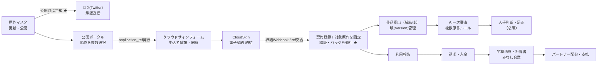
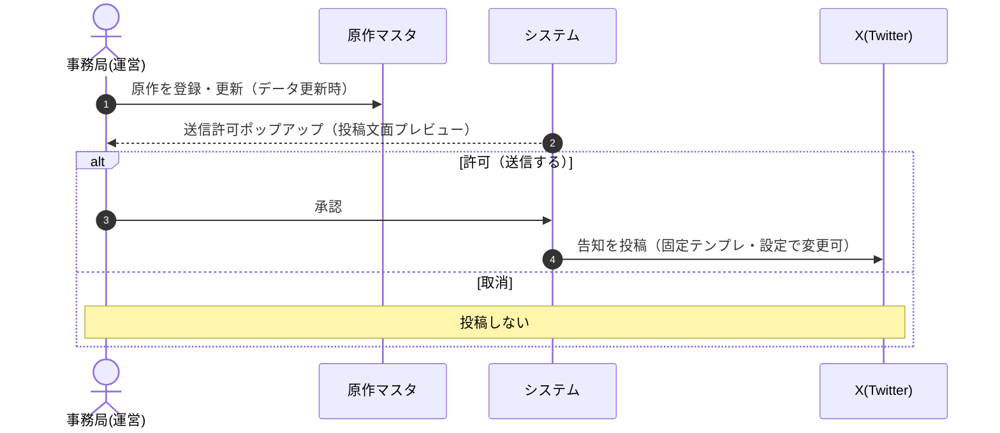
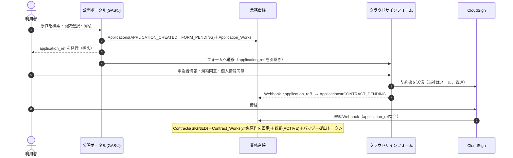
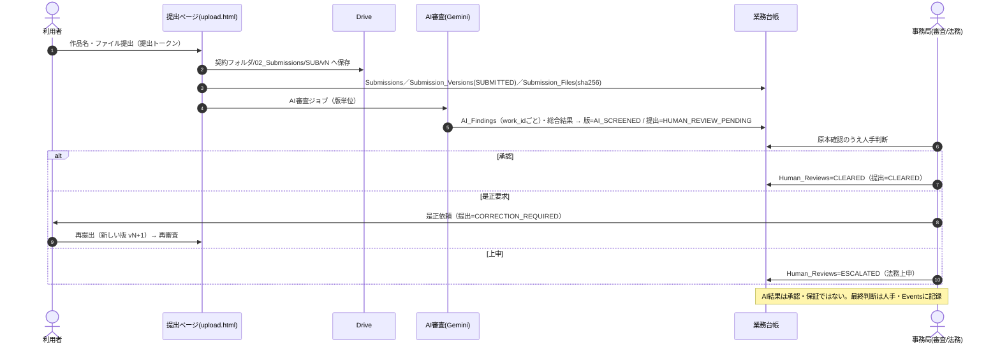
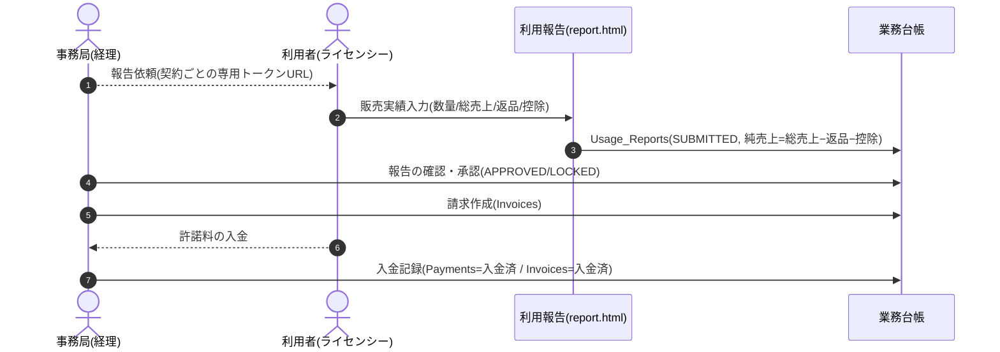
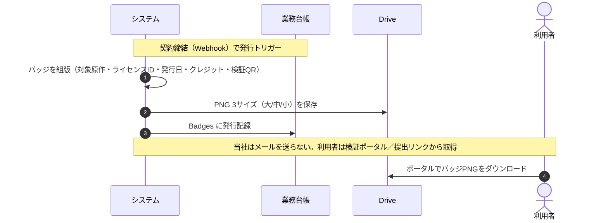
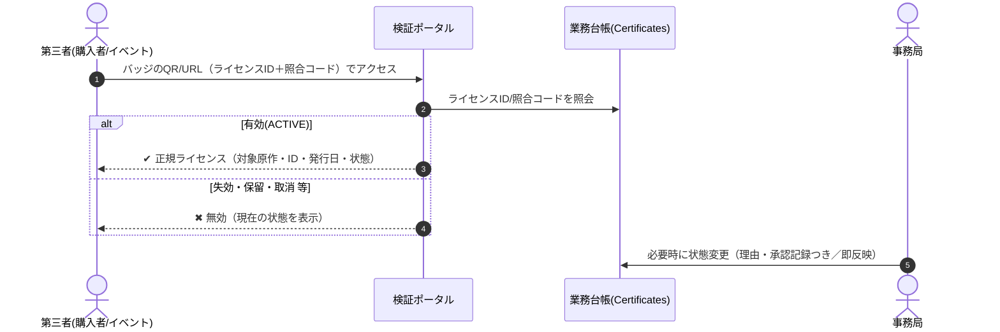
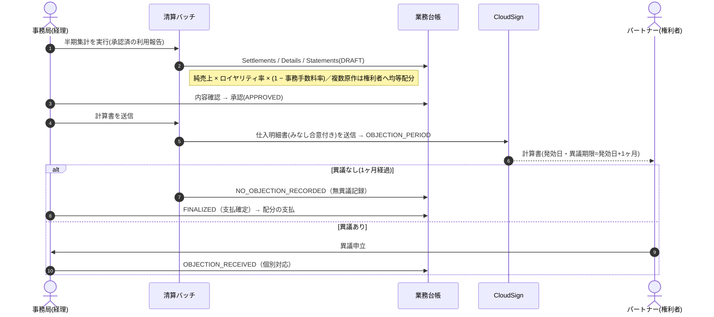

# SPLL 業務フロー確認資料（事業部すり合わせ用）

**版** v0.2（ドラフト） / **対象** 現行運用フローとのすり合わせ / **作成** 法務部
**関連** SPLL-SYS-BD-001（実装仕様書）／SPLL推奨設計書（B経路固定）

> この資料は、新SPLLシステム（Google Workspace + GAS で実装）の**業務フロー**を、
> 事業部の**現行運用**と突き合わせて確認するためのものです。図は**スイムレーン（レーン＝担当）**。
> 各表の右端「**現行運用／確認・修正**」欄に、事業部側で気づき・相違点・決定事項をご記入ください。
>
> **v0.2 主な変更点**：審査はすべて**契約締結後**に統一（**B経路固定**、旧A経路は廃止）。
> 申込は**原作を複数選択**でき、**application_ref** で申込と契約を突合します（メールハッシュ突合は廃止）。
> 提出は**版（Version）管理**、認証・バッジは**締結時**に発行。
>
> 図（Mermaid）は GitHub 上でそのまま描画されます。会議配布・PDF化には同梱の
> `SPLL_業務フロー確認資料.html` をブラウザで開いてご利用ください。

---

## 0. すり合わせの観点（この資料で確認したいこと）

1. **工程の過不足** … 現行にあってシステムに無い工程／その逆はないか
2. **自動 vs 人手の切り分け** … 「自動」としている箇所が運用実態と合うか
3. **承認者・責任分界** … 各判断（審査・請求・清算承認）の担当は誰か
4. **料率・期日・しきい値** … ロイヤリティ率・事務手数料率・締め日・異議期間 等の実値
5. **未決事項** … §9 のチェックリスト

---

## 1. 登場人物（レーン）とシステム

| レーン | 種別 | 役割 |
|---|---|---|
| 利用者（申込者／ライセンシー） | 社外 | 原作の選択・申込・契約締結・作品提出・販売実績報告・許諾料支払 |
| 公開ポータル（GAS① / index.html） | システム | 公開原作の検索・**複数選択**・同意取得・申込作成（application_ref発行） |
| クラウドサインフォーム（powered by formrun） | 外部サービス | 申込者情報・同意・契約導線（当社はメールアドレスを管理しない） |
| CloudSign | 外部サービス | 電子契約の締結・締結通知・計算書（仕入明細書）送信 |
| AI審査（Vertex AI Gemini） | システム | 提出作品の一次スクリーニング（合否ではなく候補抽出／**複数原作対応**） |
| 事務局・審査／法務 | 人手 | AI結果を受けた最終判断・是正要求・エスカレーション |
| 事務局・経理 | 人手 | 請求・入金消込・半期清算の承認 |
| パートナー（権利者／出版社） | 社外 | 計算書の受領・確認（みなし合意）・配分受取 |
| 業務台帳（Sheets / Drive） | システム記録 | **業務の単一の正本**。全状態変更を `Events` に追記 |

> ポイント：AI審査は**一次スクリーナー**であり、承認・適法性保証ではありません。最終判断は必ず人手で行い、`Events` に記録します。
> **B経路固定**：申込時に作品は提出しません。作品審査はすべて契約締結後に行います。

---

## 2. 全体像（エンドツーエンド）

> **★＝今回の追加業務**：①原作マスタ更新→**X（Twitter）告知投稿**（送信は承認制）、②**締結と同時に認証バッジ**（クレジット表記・PNG3サイズ）を発行・配布。
> **旧A経路（契約前審査）・課金モデル別のバッジ発行分岐は廃止**しました。

---

## 2.5 原作公開とX（Twitter）告知 ★

公開原作の**データ更新時**に、X（Twitter）への告知を**送信許可ポップアップ**で提示し、
承認して初めて投稿します（サイレント送信はしない）。文面は固定テンプレート（設定で変更可）。

| # | レーン | 作業 | 自動/人手 | 記録先 | 現行運用／確認・修正 |
|---|---|---|---|---|---|
| 1 | 事務局 | 原作マスタ更新（公開原作） | 手 | Works_Master |  |
| 2 | システム | 更新時に投稿文面のプレビューを提示 | 自動 | — |  |
| 3 | 事務局 | 内容を確認し**送信を承認**（または取消） | 手 | — |  |
| 4 | システム | 承認時にXへ投稿 | 自動 | Events |  |

**方針（決定）**：自動（データ更新時に提示）／**送信は承認必須**（ポップアップ）／文面は**固定テンプレ・設定で変更可**。
**要確認**：投稿する**Xアカウント**（API利用申請・キー登録が必要）。

---

## 3. 原作選択 〜 申込 〜 契約（B経路固定・メール当社非管理）

利用者は公開ポータルで**原作を複数選択**し、申込を作成します。この時点で **application_ref**（申込参照番号）を発行し、
`Applications` と `Application_Works`（選択原作）を台帳へ登録します。以降はクラウドサインフォームで申込者情報・同意を入力し、
CloudSignで締結。**当社はメールアドレスを保持しません**。締結はCloudSignのWebhookでGASへ通知し、**application_ref で申込と契約を突合**します。

| # | レーン | 作業 | 自動/人手 | 記録先 | 現行運用／確認・修正 |
|---|---|---|---|---|---|
| 1 | 利用者 | 原作を複数選択・個人情報同意・規約同意 | 手 | — |  |
| 2 | ポータル | 申込作成・**application_ref発行** | 自動 | Applications / Application_Works |  |
| 3 | フォーム | 申込者情報・同意入力（当社メール非管理） | 手 | — |  |
| 4 | フォーム→GAS | Webhookで申込を前進 | 自動 | Applications(CONTRACT_PENDING) |  |
| 5 | 利用者 | 締結 | 手 | — |  |
| 6 | CloudSign→GAS | 締結通知（**application_ref突合**）→契約＋対象原作固定＋認証＋提出トークン | 自動 | Contracts(SIGNED) / Contract_Works / Certificates(ACTIVE) / Submission_Access |  |

> **要確認（C-15）**：CloudSignの締結Webhookが **application_ref** を運べるか（フォーム項目→書類メタ／件名への埋め込み等の連携仕様）。
> 複数原作は**1つの契約で包括的に許諾**し、契約書上は「対象原作一覧」のみ個別化します（原作ごとの別料金・別契約はしない）。

---

## 4. 作品提出・審査（締結後・版管理・複数原作）

締結後、利用者は**専用の提出ページ**（Submission_Access トークン）から作品を提出します。Google Driveの共有フォルダを直接開放しません。
再提出は新しい提出を作らず、**同一提出の新しい版（Version）**として管理します。AIは**選択されたすべての原作ルール**で一次審査し、
指摘（Finding）には対象**原作ID**（work_id）を付与。AI判定だけで自動不採用にはせず、**人手審査を必須**とします。

| # | レーン | 作業 | 自動/人手 | 記録先 | 現行運用／確認・修正 |
|---|---|---|---|---|---|
| 1 | 利用者 | 提出ページで作品提出（提出トークン） | 手 | Submissions / Submission_Versions / Submission_Files |  |
| 2 | システム | Driveへ版フォルダ保存・AI審査起票 | 自動 | Drive / AI_Review_Jobs |  |
| 3 | AI審査 | 複数原作ルールで一次スクリーニング | 自動 | AI_Findings（work_id付） |  |
| 4 | 事務局 | 最終判断・是正要求・上申（**必須**） | 手 | Human_Reviews / Compliance_Alerts |  |

**確認したい運用ルール**
- AI「要確認／高リスク」時の**対応SLA**（何営業日以内に人手判断するか）
- **提出トークン**の有効期限・最大提出数（既定：30日／10回）で妥当か
- **エスカレーション先**（上申の宛先・基準）
- 個人情報（住所・口座・電話）は**AIに送らない**方針で相違ないか

---

## 5. 利用報告 〜 請求・入金

| # | レーン | 作業 | 自動/人手 | 記録先 | 現行運用／確認・修正 |
|---|---|---|---|---|---|
| 1 | 事務局 | 報告依頼（トークンURL共有） | 手/自動 | Submission_Access |  |
| 2 | 利用者 | 販売実績の報告（ログイン不要） | 手 | Usage_Reports(SUBMITTED) |  |
| 3 | 事務局 | 報告内容の確認・承認 | 手 | Usage_Reports(APPROVED/LOCKED) |  |
| 4 | 事務局 | 請求 | 手 | Invoices |  |
| 5 | 利用者 | 入金 | 手 | — |  |
| 6 | 事務局 | 入金消込 | 手 | Payments / Invoices |  |

**確認したい運用ルール**
- **料率**：作品ごとの許諾料（定額／売上◯％）と**ロイヤリティ率**の実値・料率表
- **請求書発行・入金消込**は現行会計フローと整合するか（会計システム連携の要否）
- 純売上の**控除**として認めるものの範囲

---

## 5.5 認証バッジの発行・配布 ★

**認証バッジ**（クレジット表記）を PNG 3サイズ（大/中/小）で自動生成し、利用者へ配布します（正規ライセンスの証）。
B経路固定に伴い、発行タイミングは**契約締結時**に統一しました（旧・課金モデル別の分岐は廃止）。

| # | レーン | 作業 | 自動/人手 | 記録先 | 現行運用／確認・修正 |
|---|---|---|---|---|---|
| 1 | システム | 締結で発行トリガー（契約単位・複数原作をまとめて表示） | 自動 | Contracts / Contract_Works |  |
| 2 | システム | バッジPNG3サイズを生成・Drive保存 | 自動 | Badges / Drive |  |
| 3 | 利用者 | バッジをダウンロード・クレジット表記に利用 | 手 | — |  |

**方針（決定）**：**締結時に自動発行**（B経路固定）。契約が複数原作を含む場合は、対象原作名をまとめて表示します。
**要確認**
- **バッジのデザイン**（意匠・ロゴ）と**掲載情報**（対象原作・ライセンスID・発行日・クレジット文・QRの要否）
- **3サイズの用途**（例：大＝告知バナー／中＝商品ページ／小＝奥付・SNSアイコン）
- **改変可否・表示ルール**（規約でのバッジ使用条件）

## 5.6 認証の検証・失効（固定ポータル）★

バッジは**静的な画像**なので、第三者が「本物か・今も有効か」を確認できるよう**検証ポータル**を用意します。
締結時に発行した認証（証明書）は**台帳連動**で、事務局が**いつでも状態変更**（失効／再有効 等）できます。

- **利用者**：ログイン不要。締結時に用意された**提出リンク／検証ポータル**からバッジを取得（当社メール不要）。
- **第三者**：バッジのQR→**ライセンスID＋照合コード**で**有効/無効**を確認。
- **事務局**：管理コンソール「契約管理」から**認証を失効／再有効**（検証ページに即反映）。状態変更には**理由コード・理由・承認者・法務案件ID**を記録。
- **認証状態**：`ACTIVE / SUSPENDED / REVOKED / EXPIRED / TERMINATED / PAYMENT_HOLD`
- **要確認**：照合コードの桁数（既定6桁）、失効の運用ルール（未入金時に `PAYMENT_HOLD` にするか 等）。

---

## 6. 半期清算・パートナー計算書（仕入明細書方式・みなし合意）

| # | レーン | 作業 | 自動/人手 | 記録先 | 現行運用／確認・修正 |
|---|---|---|---|---|---|
| 1 | 事務局 | 半期集計の実行 | 自動 | Settlements / Details / Statements(DRAFT) |  |
| 2 | 事務局 | 計算書の内容確認・承認 | 手 | Statements(APPROVED) |  |
| 3 | 清算 | 仕入明細書をCloudSign送信 | 自動 | Statements(OBJECTION_PERIOD) |  |
| 4 | パートナー | 内容確認（無申出はみなし合意） | 手 | — |  |
| 5 | 清算 | 異議期間満了で無異議記録 | 自動 | Statements(NO_OBJECTION_RECORDED) |  |
| 6 | 事務局 | 支払確定・配分の支払 | 手 | Statements(FINALIZED) |  |

> **清算ステータスの改称**：相手方の積極的確認と誤認されうる `CONFIRMED` は使用せず、
> `OBJECTION_PERIOD → NO_OBJECTION_RECORDED → FINALIZED`（異議時は `OBJECTION_RECEIVED`）とします。

**確認したい運用ルール**
- **締め・発効日・異議期間**：半期の締め日、発効日の定義、異議期間（**発効日＋1ヶ月**）で相違ないか
- **事務手数料率**の実値（システム既定 30%）・**ロイヤリティ率**の実値（既定 10%）
- **複数原作の配分**：1契約に複数権利者が含まれる場合の配分方法（既定＝**対象原作の権利者へ均等配分**）で妥当か
- **適格請求書**：パートナーの**登録番号**（T番号）の取得状況（`invoice_reg_number`）、未登録時の扱い
- 既発生の配分は、AI未パトロール等を理由に**当然には消滅させない**方針で相違ないか

---

## 7. 人手ポイント一覧（運用負荷の確認）

システムが自動化しても**人手が残る工程**です。担当・頻度・SLAをご確認ください。

| 工程 | 人手作業 | 想定担当 | 頻度 | 現行運用／確認・修正 |
|---|---|---|---|---|
| 作品審査 | 要確認/高リスクの最終判断・是正要求・上申（必須） | 審査/法務 | 随時 |  |
| 契約 | 締結状況の確認・提出リンクの発行・共有 | 事務局 | 随時 |  |
| 請求・入金 | 請求作成・入金消込 | 経理 | 月次/随時 |  |
| 清算 | 計算書の内容確認・承認・支払確定 | 経理/法務 | 半期 |  |
| 清算 | 異議対応・配分支払 | 経理 | 半期 |  |
| マスタ | 原作マスタ・料率・同意文/規約の更新 | 事務局/法務 | 随時 |  |
| 告知 ★ | X投稿文面の確認・**送信承認**（データ更新時のポップアップ） | 事務局/広報 | 随時 |  |
| バッジ ★ | バッジ発行の確認・再発行（必要時） | 事務局 | 随時 |  |
| 認証 ★ | 認証の**状態変更（失効／再有効 等）**（違反・解除・未入金時） | 事務局/法務 | 随時 |  |

---

## 8. ステータス定義（台帳）

| 台帳 | ステータス遷移 |
|---|---|
| Applications | APPLICATION_CREATED → FORM_PENDING → CONTRACT_PENDING → SIGNED |
| Contracts | SIGNED（締結Webhookで作成。DECLINED/CANCELLED は運用で管理） |
| Submissions | SUBMITTED → AI_SCREENING → AI_SCREENED → HUMAN_REVIEW_PENDING → CLEARED / CORRECTION_REQUIRED / ESCALATED |
| Submission_Versions | SUBMITTED → AI_SCREENING → AI_SCREENED → CLEARED / CORRECTION_REQUIRED / ESCALATED |
| AI審査ジョブ | QUEUED → SCANNING → COMPLETED / ERROR |
| AI総合結果 | PASS候補 / 要確認 / 高リスク / 判読不可（work_idごとにFinding） |
| 人手判断 | CLEARED（承認）/ CORRECTION_REQUIRED（是正）/ ESCALATED（上申） |
| Certificates（認証） | ACTIVE / SUSPENDED / REVOKED / EXPIRED / TERMINATED / PAYMENT_HOLD |
| Usage_Reports | SUBMITTED → APPROVED / LOCKED |
| Invoices | 未請求 → 請求済 → 入金待ち → 入金済（/ 取消） |
| 計算書 | DRAFT → APPROVED → SENT → OBJECTION_PERIOD → NO_OBJECTION_RECORDED / OBJECTION_RECEIVED → FINALIZED（/ SUPERSEDED） |
| 認証バッジ ★ | （締結）→ ISSUED（発行・配布済） |

---

## 9. すり合わせチェックリスト（未決・要決定）

| No. | 項目 | 決めること | 決裁/担当 | 状態 |
|---|---|---|---|---|
| C-02 | 審査SLA | 要確認/高リスクの対応期限 |  | 未 |
| C-03 | エスカレーション | 上申の基準・宛先 |  | 未 |
| C-04 | 料率表 | 作品別許諾料・ロイヤリティ率の実値 |  | 未 |
| C-05 | 事務手数料率 | 既定30%で妥当か |  | 未 |
| C-06 | 清算期日 | 締め日・発効日・異議期間（発効日+1ヶ月） |  | 未 |
| C-07 | 適格請求書 | パートナー登録番号(T番号)の取得・未登録時の扱い |  | 未 |
| C-08 | 請求・入金 | 現行会計フローとの整合・会計連携の要否 |  | 未 |
| C-09 | 個人情報 | 開示等請求の窓口、保有期間 |  | 未 |
| C-10 | 反社・未成年（Q-05a） | 反社チェック手段、未成年の締結ロジック |  | 未 |
| C-11 | 解除条項（Q-03） | 解除事由・遡及/非遡及 |  | 未 |
| C-12 | 同意文・規約 | 個人情報同意文／規約テンプレートの法務確定 |  | 未（DRAFT） |
| C-13 ★ | X告知 | 投稿アカウント（要APIキー登録） ※方式は決定：自動提示＋承認送信・固定テンプレ |  | 一部決定 |
| C-14 ★ | 認証バッジ | デザイン/掲載情報・3サイズ用途・使用条件 ※トリガーは決定：**締結時に発行** |  | 一部決定 |
| C-15 ★ | メール非管理・突合 | 方針決定：クラウドサインフォーム→CloudSign、当社メール非保持、**application_refで突合**、締結で認証「有効」・状態変更可。要確認＝**締結Webhookがapplication_refを運べるか**／照合コード仕様／フォーム連携プラン |  | 一部決定 |
| C-16 | 複数原作の配分 | 1契約に複数権利者が含まれる場合の配分方法（既定＝均等配分）で妥当か |  | 未 |
| C-17 | 提出トークン | 有効期限・最大提出数（既定30日／10回）で妥当か |  | 未 |

---

## 10. 補足：システム上の自動処理と記録

- **正本はスプレッドシート（業務台帳）**。状態変更は `Events` に追記し、提出原本・AI結果・発行済計算書は**上書きしない**。
- **契約対象原作は締結時に `Contract_Works` へスナップショット**。申込後に原作マスタが変わっても、契約時点の対象原作を追跡できます。
- **秘密情報**（CloudSign資格情報等）は ScriptProperties 管理。公開APIは返却列をホワイトリスト化（内部メモ・配分は返さない）。
- **CloudSign は現在サンドボックス（試験環境）** に設定。本番切替は疎通確認後。
- **同意文・規約・原作マスタ・料率**は管理コンソール「設定」から更新可能（コード改修不要）。

---

> 本資料は設計検討・すり合わせ用のドラフト（v0.2）です。ガイドライン本文・規約・参加パブリッシャの正式記載、
> および料率・期日等の数値は**確定前**です。事業部確認の結果を反映して更新します。
