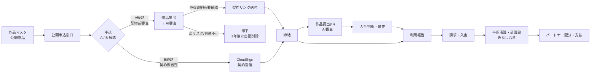
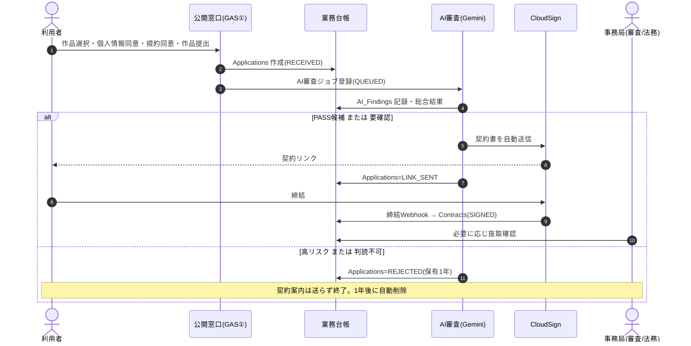
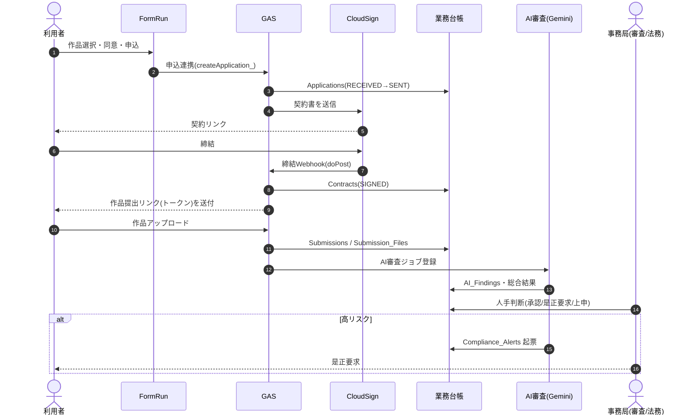
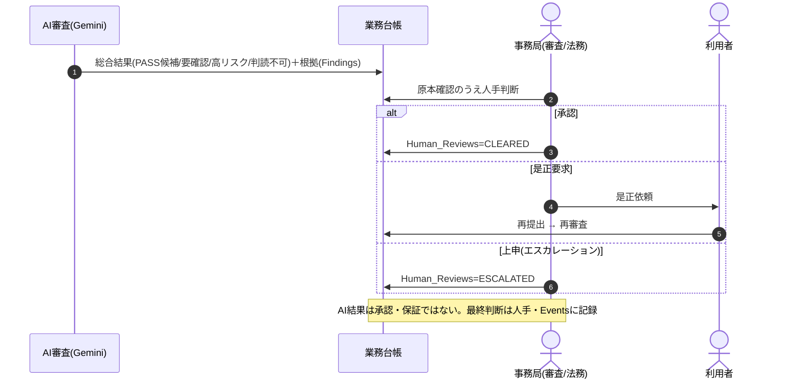
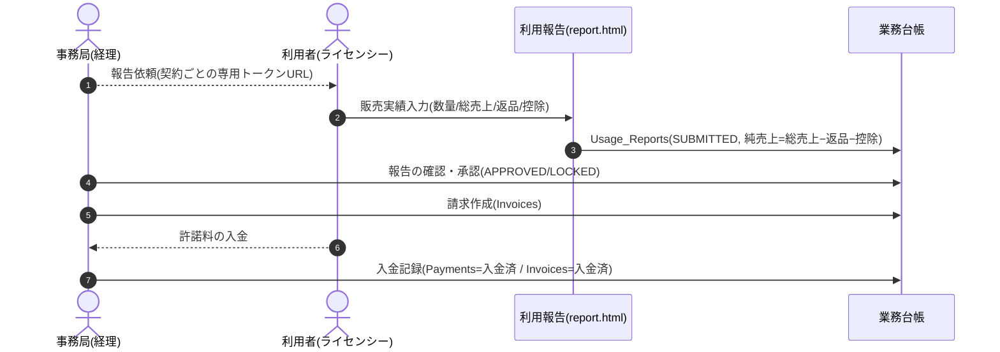
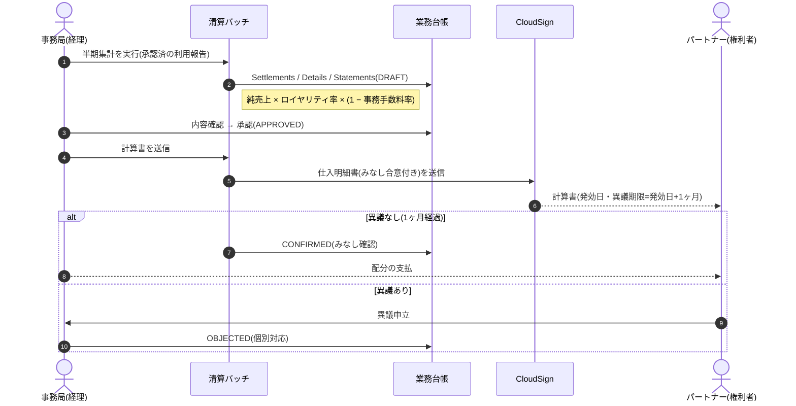

# SPLL 業務フロー確認資料（事業部すり合わせ用）

**版** v0.1（ドラフト） / **対象** 現行運用フローとのすり合わせ / **作成** 法務部
**関連** SPLL-SYS-BD-001（実装仕様書）

> この資料は、新SPLLシステム（Google Workspace + GAS で実装）の**業務フロー**を、
> 事業部の**現行運用**と突き合わせて確認するためのものです。図は**スイムレーン（レーン＝担当）**。
> 各表の右端「**現行運用／確認・修正**」欄に、事業部側で気づき・相違点・決定事項をご記入ください。
>
> 図（Mermaid）は GitHub 上でそのまま描画されます。会議配布・PDF化には同梱の
> `SPLL_業務フロー確認資料.html` をブラウザで開いてご利用ください。

---

## 0. すり合わせの観点（この資料で確認したいこと）

1. **工程の過不足** … 現行にあってシステムに無い工程／その逆はないか
2. **自動 vs 人手の切り分け** … 「自動」としている箇所が運用実態と合うか
3. **承認者・責任分界** … 各判断（審査・請求・清算承認）の担当は誰か
4. **料率・期日・しきい値** … ロイヤリティ率・事務手数料率・締め日・異議期間 等の実値
5. **未決事項** … §9 のチェックリスト

---

## 1. 登場人物（レーン）とシステム

| レーン | 種別 | 役割 |
|---|---|---|
| 利用者（申込者／ライセンシー） | 社外 | 二次創作の申込・作品提出・販売実績報告・許諾料支払 |
| 公開申込窓口（GAS① / index.html） | システム | 公開作品の表示・同意取得・申込受付 |
| FormRun | 外部サービス | 申込フォーム（B経路の入口） |
| CloudSign | 外部サービス | 電子契約の送信・締結・計算書（仕入明細書）送信 |
| AI審査（Vertex AI Gemini） | システム | 提出作品の一次スクリーニング（合否ではなく候補抽出） |
| 事務局・審査／法務 | 人手 | AI結果を受けた最終判断・是正要求・エスカレーション |
| 事務局・経理 | 人手 | 請求・入金消込・半期清算の承認 |
| パートナー（権利者／出版社） | 社外 | 計算書の受領・確認（みなし合意）・配分受取 |
| 業務台帳（Sheets / Drive） | システム記録 | **業務の単一の正本**。全状態変更を `Events` に追記 |

> ポイント：AI審査は**一次スクリーナー**であり、承認・適法性保証ではありません。最終判断は必ず人手で行い、`Events` に記録します。

---

## 2. 全体像（エンドツーエンド）

**経路の違い（要すり合わせ）**

| 経路 | 審査タイミング | 想定作品 | 締結までの流れ |
|---|---|---|---|
| **A経路** | 契約**前**（申込時に作品提出→AI審査→通過者にのみ契約案内） | 事前確認を要する作品 | 申込＋提出 → 審査 → 契約リンク → 締結 |
| **B経路** | 契約**後**（締結後に提出→AI審査・継続パトロール） | 定型条件で先に契約する作品 | 申込 → 契約送信 → 締結 → 提出 → 審査 |

> **Q-01：どの作品をA/Bにするかの割当ルール・決裁者は？**（システムは両対応。運用で決定）

---

## 3. 申込〜契約

### 3.1 A経路（契約前審査）

| # | レーン | 作業 | 自動/人手 | 記録先 | 現行運用／確認・修正 |
|---|---|---|---|---|---|
| 1 | 利用者 | 作品選択・個人情報同意・規約同意・作品提出 | 手 | — |  |
| 2 | 窓口 | 申込受付 | 自動 | Applications(RECEIVED) |  |
| 3 | AI審査 | 一次スクリーニング | 自動 | AI_Review_Jobs / AI_Findings |  |
| 4a | AI審査 | 通過者へ契約書送信 | 自動 | Applications(LINK_SENT) |  |
| 4b | 事務局 | 抜取確認（任意） | 手 | Human_Reviews |  |
| 5 | 利用者 | 締結 | 手 | — |  |
| 6 | CloudSign | 締結通知 | 自動 | Contracts(SIGNED) |  |
| 7 | AI審査 | 高リスクは却下 | 自動 | Applications(REJECTED, 1年後削除) |  |

### 3.2 B経路（契約後審査）

| # | レーン | 作業 | 自動/人手 | 記録先 | 現行運用／確認・修正 |
|---|---|---|---|---|---|
| 1 | 利用者 | 申込（FormRun） | 手 | — |  |
| 2 | GAS | 申込受付・契約送信 | 自動 | Applications(SENT) |  |
| 3 | 利用者 | 締結 | 手 | — |  |
| 4 | CloudSign→GAS | 締結通知・提出案内送付 | 自動 | Contracts(SIGNED) / Upload_Tokens |  |
| 5 | 利用者 | 作品提出 | 手 | Submissions / Submission_Files |  |
| 6 | AI審査 | 一次スクリーニング | 自動 | AI_Review_Jobs / AI_Findings |  |
| 7 | 事務局 | 最終判断・是正要求・上申 | 手 | Human_Reviews / Compliance_Alerts |  |

---

## 4. 作品審査・是正（AI一次審査 ＋ 人手判断）

**確認したい運用ルール**
- AI「要確認／高リスク」時の**対応SLA**（何営業日以内に人手判断するか）
- **抜取確認**の対象・比率（PASS候補をどの程度サンプリングするか）
- **エスカレーション先**（上申の宛先・基準）
- 個人情報（住所・口座・電話）は**AIに送らない**方針で相違ないか

---

## 5. 利用報告 〜 請求・入金

| # | レーン | 作業 | 自動/人手 | 記録先 | 現行運用／確認・修正 |
|---|---|---|---|---|---|
| 1 | 事務局 | 報告依頼（トークンURL送付） | 手/自動 | Upload_Tokens |  |
| 2 | 利用者 | 販売実績の報告（ログイン不要） | 手 | Usage_Reports(SUBMITTED) |  |
| 3 | 事務局 | 報告内容の確認・承認 | 手 | Usage_Reports(APPROVED/LOCKED) |  |
| 4 | 事務局 | 請求 | 手 | Invoices |  |
| 5 | 利用者 | 入金 | 手 | — |  |
| 6 | 事務局 | 入金消込 | 手 | Payments / Invoices |  |

**確認したい運用ルール**
- **料率**：作品ごとの許諾料（定額／売上◯％）と**ロイヤリティ率**の実値・料率表
- **請求書発行・入金消込**は現行会計フローと整合するか（会計システム連携の要否）
- 純売上の**控除**として認めるものの範囲

---

## 6. 半期清算・パートナー計算書（仕入明細書方式・みなし合意）

| # | レーン | 作業 | 自動/人手 | 記録先 | 現行運用／確認・修正 |
|---|---|---|---|---|---|
| 1 | 事務局 | 半期集計の実行 | 自動 | Settlements / Details / Statements(DRAFT) |  |
| 2 | 事務局 | 計算書の内容確認・承認 | 手 | Statements(APPROVED) |  |
| 3 | 清算 | 仕入明細書をCloudSign送信 | 自動 | Statements(SENT) |  |
| 4 | パートナー | 内容確認（無申出はみなし合意） | 手 | — |  |
| 5 | 清算 | 異議期間満了で確認確定 | 自動 | Statements(CONFIRMED) |  |
| 6 | 事務局 | 配分の支払 | 手 | — |  |

**確認したい運用ルール**
- **締め・発効日・異議期間**：半期の締め日、発効日の定義、異議期間（**発効日＋1ヶ月**）で相違ないか
- **事務手数料率**の実値（システム既定 30%）・**ロイヤリティ率**の実値（既定 10%）
- **適格請求書**：パートナーの**登録番号**（T番号）の取得状況（`invoice_reg_number`）、未登録時の扱い
- 既発生の配分は、AI未パトロール等を理由に**当然には消滅させない**方針で相違ないか

---

## 7. 人手ポイント一覧（運用負荷の確認）

システムが自動化しても**人手が残る工程**です。担当・頻度・SLAをご確認ください。

| 工程 | 人手作業 | 想定担当 | 頻度 | 現行運用／確認・修正 |
|---|---|---|---|---|
| 作品審査 | 要確認/高リスクの最終判断・是正要求・上申 | 審査/法務 | 随時 |  |
| 作品審査 | PASS候補の抜取確認 | 審査 | 随時 |  |
| 契約 | 締結状況の確認・再送 | 事務局 | 随時 |  |
| 請求・入金 | 請求作成・入金消込 | 経理 | 月次/随時 |  |
| 清算 | 計算書の内容確認・承認 | 経理/法務 | 半期 |  |
| 清算 | 異議対応・配分支払 | 経理 | 半期 |  |
| マスタ | 作品マスタ・料率・同意文/規約の更新 | 事務局/法務 | 随時 |  |

---

## 8. ステータス定義（台帳）

| 台帳 | ステータス遷移 |
|---|---|
| Applications（A） | RECEIVED → AI_SCREENED → LINK_SENT / REJECTED → SIGNED |
| Applications（B） | RECEIVED → SENT → SIGNED |
| Contracts | SENT → SIGNED / DECLINED / CANCELLED |
| AI審査ジョブ | QUEUED → SCANNING → COMPLETED / ERROR |
| AI総合結果 | PASS候補 / 要確認 / 高リスク / 判読不可 |
| 人手判断 | CLEARED（承認）/ CORRECTION_REQUIRED（是正）/ ESCALATED（上申） |
| Usage_Reports | SUBMITTED → APPROVED / LOCKED |
| Invoices | 未請求 → 請求済 → 入金待ち → 入金済（/ 取消） |
| 計算書 | DRAFT → APPROVED → SENT → CONFIRMED / OBJECTED → ISSUED（/ SUPERSEDED） |

---

## 9. すり合わせチェックリスト（未決・要決定）

| No. | 項目 | 決めること | 決裁/担当 | 状態 |
|---|---|---|---|---|
| C-01 | A/B割当（Q-01） | 作品ごとの審査タイミングの決定基準・決裁者 |  | 未 |
| C-02 | 審査SLA・抜取率 | 要確認/高リスクの対応期限、PASS候補の抜取比率 |  | 未 |
| C-03 | エスカレーション | 上申の基準・宛先 |  | 未 |
| C-04 | 料率表 | 作品別許諾料・ロイヤリティ率の実値 |  | 未 |
| C-05 | 事務手数料率 | 既定30%で妥当か |  | 未 |
| C-06 | 清算期日 | 締め日・発効日・異議期間（発効日+1ヶ月） |  | 未 |
| C-07 | 適格請求書 | パートナー登録番号(T番号)の取得・未登録時の扱い |  | 未 |
| C-08 | 請求・入金 | 現行会計フローとの整合・会計連携の要否 |  | 未 |
| C-09 | 個人情報 | 開示等請求の窓口、保有期間（A落選=1年） |  | 未 |
| C-10 | 反社・未成年（Q-05a） | 反社チェック手段、未成年の締結ロジック |  | 未 |
| C-11 | 解除条項（Q-03） | B経路の解除事由・遡及/非遡及 |  | 未 |
| C-12 | 同意文・規約 | 個人情報同意文／規約テンプレートの法務確定 |  | 未（DRAFT） |

---

## 10. 補足：システム上の自動処理と記録

- **正本はスプレッドシート（業務台帳）**。状態変更は `Events` に追記し、提出原本・AI結果・発行済計算書は**上書きしない**。
- **秘密情報**（CloudSign資格情報等）は ScriptProperties 管理。公開APIは返却列をホワイトリスト化（内部メモ・配分は返さない）。
- **CloudSign は現在サンドボックス（試験環境）** に設定。本番切替は疎通確認後。
- **同意文・規約・作品マスタ・料率**は管理コンソール「設定」から更新可能（コード改修不要）。

---

> 本資料は設計検討・すり合わせ用のドラフト（v0.1）です。ガイドライン本文・規約・参加パブリッシャの正式記載、
> および料率・期日等の数値は**確定前**です。事業部確認の結果を反映して更新します。
