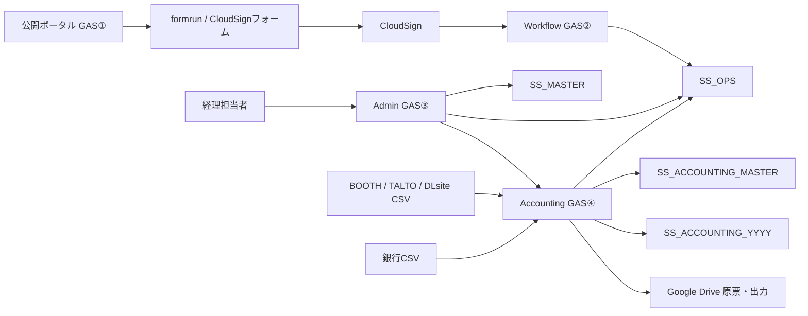
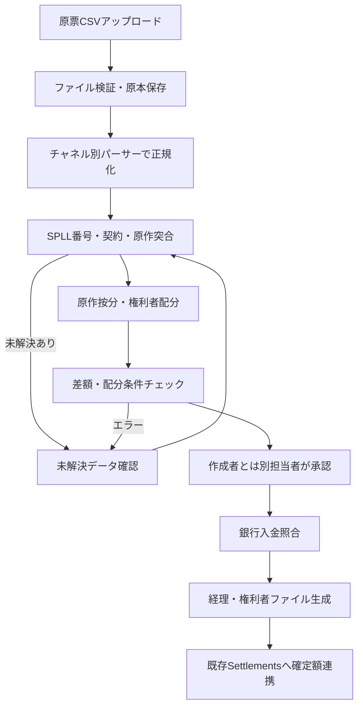

# SPLL 経理連携・クラウドサイン運用拡張設計書

| 項目 | 内容 |
|---|---|
| 文書番号 | SPLL-SYS-AD-001 |
| 版数 | v0.1 |
| 作成日 | 2026年8月3日 |
| 対象リポジトリ | `tatsuyakuramchi/SPLL` |
| 対象基盤 | Google Apps Script / Google Sheets / Google Drive / formrun / CloudSign |
| 関連文書 | `SPLL_修正設計書_v2.0.md` / `SPLL_クラウドサインフォーム項目設計_v1.0.md` |
| ステータス | Claude Code実装用設計 |

---

## 1. 目的

本設計書は、現行SPLLシステムへ次の2領域を追加するための実装仕様を定める。

1. BOOTH、TALTO、DLsite、銀行入出金等の原票を取り込み、SPLL番号・原作・権利者へ突合し、経理向け及び権利者向けの報告ファイルを生成する経理連携機能
2. SPLL公開ポータルからクラウドサインフォームを経由して契約締結する現行運用について、連携失敗、未紐付け、訂正、例外案件、メール不達等を管理可能にする運用拡張

初期実装はGASを維持する。ただし、大量明細を既存`SS_OPS`へ直接追加せず、経理専用GAS及び経理専用Spreadsheetへ分離する。

---

## 2. 実装上の確定方針

### 2.1 GAS継続

初期リリースはGASで構築する。

- 既存のPortal、Workflow、Adminの3プロジェクト構成を維持する
- 第4のGASプロジェクトとしてAccountingを追加する
- 管理画面は既存Adminへ「経理連携」タブを追加する
- 販売・配分・銀行明細は経理専用Spreadsheetを正本とする
- 確定した権利者別支払額のみ既存`Settlements`系へ連携する

### 2.2 既存データ構造の保護

- 既存シート名及び既存列の削除・並替えを行わない
- 既存テーブルへの変更は末尾列追加のみとする
- 新機能は原則として新規シートで実装する
- マイグレーションは既存の`migrateSchema_`方式に統合する
- 本番データの初期化及びサンプル投入を行わない

### 2.3 自動契約と手動確認の分離

クラウドサインフォームは全案件を自動送信対象としない。

**自動送信対象**

- 国内の成人又は国内法人
- 標準料金モデル
- 標準契約条項
- 対象原作が上限以内
- 特約なし
- handoff検証に成功

**手動確認対象**

- 未成年
- 海外居住者・海外法人
- 契約締結権限者の確認が必要
- 「その他」利用
- 特約あり
- 長文クレジット又は多数原作
- 料金・原作・申込スナップショット不一致
- formrunからCloudSignへの連携失敗
- メール不達

---

## 3. 対象範囲

### 3.1 対象

- BOOTH販売明細CSV取込
- TALTO販売明細CSV取込
- DLsite販売明細CSV取込
- 三菱UFJ銀行入出金明細CSV取込
- 販売明細の共通形式への正規化
- 旧SPLL番号及び現行契約との突合
- 複数原作及び商品別原作判定
- 原作別・権利者別配分
- プラットフォーム入金との照合
- 直接入金と既存`Invoices`との照合
- 経理向け月次ファイル生成
- 権利者別月次・四半期ファイル生成
- formrun / CloudSign連携状態管理
- CloudSign未送信・未紐付け・メール不達・再締結管理

### 3.2 初期対象外

- 会計システムAPIへの直接仕訳登録
- BOOTH等の販売プラットフォームAPIによるリアルタイム取込
- 外貨換算
- 海外源泉税の自動判定
- 自動振込データ生成
- 旧Excelマクロの完全再現
- Cloud SQLへの移行

---

## 4. 目標アーキテクチャ



### 4.1 GASプロジェクト

| プロジェクト | 役割 | 公開範囲 |
|---|---|---|
| Portal GAS① | 原作検索、申込作成、handoff発行 | 匿名公開 |
| Workflow GAS② | Webhook、契約、提出、報告、既存清算 | Webhook・トークン経由 |
| Admin GAS③ | 社内管理画面、承認、マスタ管理 | Google Workspaceドメイン限定 |
| Accounting GAS④ | 原票取込、突合、配分、銀行照合、帳票生成 | Google Workspaceドメイン限定 |

Accounting GAS④には、CloudSign Webhook及び匿名公開関数を含めない。

### 4.2 Spreadsheet

| Spreadsheet | 内容 |
|---|---|
| `SS_MASTER` | 既存作品マスタ、料金表 |
| `SS_OPS` | 既存申込、契約、審査、請求、入金、清算 |
| `SS_ACCOUNTING_MASTER` | 販売チャネル、旧番号、原作対応、配分ルール、出力設定 |
| `SS_ACCOUNTING_2026`等 | 年度別販売台帳、配分、銀行取引、照合、出力履歴 |

経理明細は年度単位でSpreadsheetを分割する。ScriptPropertiesの`SS_ACCOUNTING_CURRENT`で現年度のIDを管理し、`Accounting_Books`マスタに年度別IDを保存する。

---

## 5. エンドツーエンド業務フロー



### 5.1 月次締め

1. チャネルごとに原票を取り込む
2. 原票行数及び原票記載合計を確認する
3. SPLL番号・商品・原作の突合結果を確認する
4. 未解決データを解消する
5. 配分計算を実行する
6. 原票総額と配分総額の差額が0円であることを確認する
7. 別担当者が配分実行を承認する
8. 銀行明細を取り込み、プラットフォーム入金又は直接入金へ照合する
9. 経理向けファイルを生成する
10. 権利者向けファイルを生成する
11. 既存清算へ確定額を連携する

---

## 6. 経理データモデル

以下の新規シートは`SS_ACCOUNTING_MASTER`又は年度別`SS_ACCOUNTING_YYYY`に作成する。

## 6.1 マスタ系

### `Accounting_Books`

```text
year, spreadsheet_id, status, opened_at, closed_at, closed_by
```

### `Sales_Channels`

```text
channel_id, channel_name, parser_type, default_encoding,
payer_aliases_json, receivable_account, statement_basis,
active, updated_by, updated_at
```

初期値：`BOOTH`、`TALTO`、`DLSITE`、`BANK_DIRECT`、`AMBASS`、`PAPER`。

### `License_Identifiers`

```text
license_identifier_id, contract_id, identifier_type,
identifier_value, identifier_normalized, status,
effective_from, effective_to, source, created_by, created_at
```

旧SPLL番号と現行`contract_id`を対応させる。旧案件は`contract_id`を空欄とし、原作マッピングだけを使用できる。

### `Legacy_Work_Codes`

```text
legacy_code, work_id, effective_from, effective_to,
status, note, updated_by, updated_at
```

例：`E107009`の`107`を原作コードとして解決する。

### `Sales_Work_Mappings`

```text
mapping_id, external_license_ref, channel_id,
source_product_id, product_name_key, match_scope,
work_id, allocation_weight, priority, status,
effective_from, effective_to, approved_by, approved_at
```

`match_scope`：

- `LICENSE_PRODUCT_ID`
- `LICENSE_PRODUCT`
- `LICENSE_ONLY`
- `CONTRACT`

### `Distribution_Profiles`

```text
distribution_profile_id, work_id, profile_name, version,
rounding_method, status, effective_from, effective_to,
approved_by, approved_at, created_at
```

### `Distribution_Profile_Lines`

```text
profile_line_id, distribution_profile_id, partner_id,
role_code, calculation_type, rate, tax_treatment,
account_code, sort_order, active
```

`calculation_type`：

- `RATE`：指定率で計算
- `RESIDUAL`：RATE計算後の残額を配分

1プロファイルにつき`RESIDUAL`は1行までとする。

### `Accounting_Export_Profiles`

```text
export_profile_id, export_type, profile_name,
template_drive_file_id, version, status,
config_json, updated_by, updated_at
```

初期プロファイル：

- `LEGACY_V3_07`
- `CONSOLIDATED_V1`
- `PARTNER_MONTHLY_V1`
- `PARTNER_QUARTERLY_V1`

---

## 6.2 取込系

### `Sales_Import_Batches`

```text
import_batch_id, channel_id, sales_period,
file_name, drive_file_id, file_hash, parser_version,
source_row_count, source_total_amount,
normalized_row_count, normalized_total_amount,
status, supersedes_batch_id, imported_by, imported_at,
started_at, finished_at, error_summary
```

状態：

```text
UPLOADED -> PARSING -> PARSED -> MATCHING
MATCHING -> REVIEW_REQUIRED | READY
READY -> ALLOCATED -> APPROVED -> POSTED -> EXPORTED
旧版はSUPERSEDED
失敗はERROR
```

### `Sales_Ledger`

```text
sales_row_id, import_batch_id, source_row_no,
channel_id, sales_period, source_product_id,
source_project_id, product_name, seller_name,
external_license_ref, unit_price, quantity,
boost_amount, gross_sales_amount,
platform_net_sales_amount, license_fee_amount,
currency, raw_row_hash, match_status,
allocation_status, created_at
```

`license_fee_amount`をプラットフォーム原票の配分対象正本とする。

### `Sales_Match_Results`

```text
match_result_id, sales_row_id, contract_id,
work_id, match_method, confidence, mapping_id,
status, reviewed_by, reviewed_at, note
```

`match_method`：

- `LICENSE_PRODUCT_ID`
- `LICENSE_PRODUCT`
- `LICENSE_ONLY`
- `CONTRACT_SNAPSHOT`
- `LEGACY_CODE`
- `MANUAL`
- `UNMATCHED`

商品名の曖昧検索は候補提示にのみ使用し、自動確定しない。

---

## 6.3 配分系

### `Allocation_Runs`

```text
allocation_run_id, sales_period, import_batch_ids_json,
rule_snapshot_hash, status, source_total_amount,
allocated_total_amount, difference_amount, exception_count,
prepared_by, prepared_at, approved_by, approved_at,
posted_at, error_summary
```

状態：

```text
DRAFT -> CALCULATING
CALCULATING -> REVIEW_REQUIRED | READY_FOR_APPROVAL
READY_FOR_APPROVAL -> APPROVED -> POSTED -> EXPORTED
取消時はVOID
```

作成者と承認者は同一人物不可とする。ただし緊急時は理由必須で`EMERGENCY_OVERRIDE`としてEventsへ記録する。

### `Allocation_Details`

```text
allocation_detail_id, allocation_run_id, sales_row_id,
contract_id, work_id, partner_id,
work_allocation_weight, partner_rate,
base_license_fee_amount, work_allocated_amount,
allocated_amount, payable_amount,
rounding_adjustment, tax_treatment_snapshot,
profile_id_snapshot, profile_version_snapshot,
calculation_json, status, created_at
```

### 配分計算順序

1. 販売行の`license_fee_amount`を原作へ按分する
2. 原作ごとの配分プロファイルを適用する
3. `RATE`行を四捨五入する
4. 原作按分額からRATE合計を控除した残額を`RESIDUAL`へ配分する
5. 税・源泉等の支払調整を行い`payable_amount`を算出する
6. 計算根拠を`calculation_json`へ保存する

### 複数原作の端数

複数原作の按分は最大剰余法を使用する。同率2原作で25円の場合、13円と12円に配分し、合計25円を維持する。

### 整合性条件

```text
販売原票の許諾料合計
= 原作別按分額合計
= 権利者別allocated_amount合計
```

`difference_amount`が0円でない配分実行は承認できない。

---

## 6.4 銀行・照合系

### `Bank_Import_Batches`

```text
bank_import_batch_id, bank_code, account_key,
file_name, drive_file_id, file_hash,
source_row_count, status, imported_by, imported_at,
error_summary
```

### `Bank_Transactions`

```text
bank_transaction_id, bank_import_batch_id,
source_row_no, transaction_date, transaction_type,
payer_name_raw, payer_name_normalized,
debit_amount, credit_amount, balance,
raw_row_hash, match_status, created_at
```

### `Bank_Reconciliations`

```text
reconciliation_id, target_type, target_id,
expected_amount, applied_amount, difference_amount,
status, confirmed_by, confirmed_at, note
```

`target_type`：

- `PLATFORM_BATCH`
- `INVOICE`
- `UNIDENTIFIED`

### `Bank_Reconciliation_Lines`

```text
reconciliation_line_id, reconciliation_id,
bank_transaction_id, applied_amount, created_at
```

1件の入金を複数対象へ配分し、複数入金を1対象へ充当できるようにする。

プラットフォーム入金候補は、チャネル、対象期間、名義候補、金額から提示する。直接入金候補は、摘要・名義中のSPLL番号、未入金Invoice、金額から提示する。自動候補は自動確定しない。

---

## 6.5 出力系

### `Accounting_Exports`

```text
export_id, allocation_run_id, export_type,
export_profile_id, template_version, version,
drive_file_id, zip_file_id, file_hash,
status, generated_by, generated_at,
approved_by, approved_at, delivered_at
```

出力ファイルは上書きしない。再生成時は`version`を増加させる。

### 経理向け出力

`LEGACY_V3_07`：

- 説明文
- 各社への支払
- 明細
- 複数原作明細①
- 複数原作明細②
- BOOTH
- TALTO
- DLsite
- 直接振込
- 原作マスタ
- 更新履歴

`CONSOLIDATED_V1`：

- サマリー
- 入金照合
- チャネル別集計
- 支払先別集計
- 販売明細
- 配分明細
- 未解決・警告
- 原票・計算条件

### 権利者向け出力

- 権利者名
- 対象期間
- 販売月
- 販売サイト
- SPLL番号
- 二次創作物名
- サークル名
- 販売単価
- 販売数
- BOOST
- 許諾料
- 原作名
- 配分率
- 権利者配分額
- 税処理
- 支払予定額

月次及び四半期単位で作成し、権利者別フォルダへ保存する。全権利者分のZIPも生成する。

---

## 7. CSVパーサー仕様

各パーサーは次の共通インターフェースを実装する。

```javascript
function parseSalesFile_(blob, context) {
  return {
    parser_version: '...',
    source_row_count: 0,
    source_total_amount: 0,
    rows: [],
    warnings: []
  };
}
```

### 7.1 BOOTH

入力例：`ピクシブ_Booth_明細書_2026.6.csv`

主な入力列：

- ショップ名
- 商品番号
- 商品名
- SPLL申請番号
- 小売価格
- 数量
- BOOST計
- 売上（税込）
- ライセンス料（税込）

受入基準：7,446件、許諾料合計4,609,606円。

### 7.2 TALTO

入力例：`ココフォリア_TALTO_admin_license_fee_spll_spll_2025_12.csv`

先頭に集計期間・総額があり、その後にヘッダ・明細が続く形式を処理する。

主な入力列：

- 許諾番号
- プロジェクトID
- 作品名
- 販売数
- 販売額計
- 売上計
- 販売許諾料小計

受入基準：52件、許諾料合計4,591円。

### 7.3 DLsite

入力例：`エイシス_DLsite_TRPG集計2026年05月.csv`

主な入力列：

- DLsite作品ID
- 作品名
- SPLL申請番号
- 販売本数
- ライセンス料合計

受入基準：17件、許諾料合計1,157円。

### 7.4 三菱UFJ銀行

入力例：`三菱UFJ銀行_入金明細_20260731.csv`

レコード種別によるヘッダ、取引、合計行を判定する。取引行のみ`Bank_Transactions`へ登録する。

受入基準：

- ピクシブ株式会社4,609,606円をBOOTH対象月の候補として提示する
- 株式会社エイシス1,157円をDLsite対象月の候補として提示する

### 7.5 共通検証

- ファイル名だけでチャネルを確定しない
- アップロード時に利用者がチャネルと対象月を選択する
- CSVヘッダが期待値と一致しない場合は取込停止
- 金額列の空欄、不正文字、負数を検証する
- 外部入力はSpreadsheet数式インジェクション対策を行う
- 原票ファイルをDriveへ保存しSHA-256を記録する
- 同一ハッシュの二重取込を拒否する

---

## 8. 大量処理・GAS実行制限への対応

経理処理では既存`appendRow_`及びセル単位`setValue`を使用しない。

### 8.1 追加共通関数

```javascript
readTableBulk_(spreadsheet, sheetName)
appendRowsBulk_(spreadsheet, sheetName, objects, chunkSize)
replaceRowsBulk_(spreadsheet, sheetName, objects)
buildIndex_(rows, keyFn)
upsertRowsBulk_(spreadsheet, sheetName, keyColumn, objects)
```

### 8.2 ジョブ分割

### `Accounting_Jobs`

```text
job_id, job_type, target_id, status,
cursor, total_count, processed_count,
retry_count, next_retry_at, started_at,
finished_at, owner, last_error, detail_json
```

`job_type`：

- `SALES_PARSE`
- `SALES_MATCH`
- `ALLOCATION_CALCULATE`
- `BANK_MATCH`
- `ACCOUNTING_EXPORT`
- `PARTNER_EXPORT`
- `SETTLEMENT_POST`

1実行あたり500～1,000行を目安とし、5分を超える前にカーソルを保存して終了する。時間主導トリガーは1分又は5分単位で継続する。

### 8.3 排他・冪等

- ジョブ開始時にScriptLockを取得する
- `RUNNING`のまま一定時間経過したジョブは回復対象とする
- 販売行は`raw_row_hash`で重複を防止する
- 配分明細は`allocation_run_id + sales_row_id + work_id + partner_id`を冪等キーとする
- 確定済み配分の再実行は新しいrunを作成し、旧runを上書きしない
- 既存`Settlement_Details`への連携は`source_type=ACCOUNTING_ALLOCATION`相当の参照情報を持たせ、二重連携を防止する

---

## 9. 既存`SS_OPS`への変更

### 9.1 `Applications`追加列

末尾に追加する。

```text
form_submission_id,
form_submitted_at,
cloudsign_send_status,
cloudsign_send_error,
manual_review_reason,
supersedes_application_id,
superseded_by_application_id
```

### 9.2 `Contracts`追加列

```text
form_submission_id,
route_type,
terms_verification_status,
terms_verification_detail,
delivery_status,
last_delivery_event_at
```

`route_type`：`AUTO`又は`MANUAL`。

`terms_verification_status`：

- `PENDING`
- `VERIFIED`
- `TERMS_MISMATCH`
- `MANUAL_CONFIRMED`

### 9.3 `Webhook_Receipts`追加列

```text
event_type,
document_id,
application_ref,
response_code
```

### 9.4 `Settlement_Details`追加列

```text
source_type,
source_id,
accounting_allocation_detail_id
```

既存清算との互換性を維持するため、旧行は空欄を許容する。

---

## 10. クラウドサインフォーム運用拡張

## 10.1 フォーム構成

初期運用は次の3経路とする。

| 経路 | 用途 | CloudSign自動送信 |
|---|---|---|
| `STANDARD_FIXED` | 書籍・商品・標準イベント等 | する |
| `STANDARD_RATE` | 電子出版物・サブスクリプション等 | する |
| `MANUAL_REVIEW` | 未成年・海外・特約・その他 | しない |

フォームを用途ごとに過剰分割せず、料金モデル別2フォーム＋個別確認1フォームを基本とする。

## 10.2 URL・hidden項目

公開ポータルから渡す値は最小化する。

```text
application_ref
handoff_token
usage_category
work_count
work_id_1..5
work_title_1..5
template_route
```

次の長文はURLへ渡さない。

- 支払条件全文
- 報告条件全文
- クレジット全文
- 規約本文
- 特記事項全文

標準条件はCloudSignテンプレートへ固定し、締結後は`application_ref`から台帳スナップショットを取得して照合する。

## 10.3 自動送信判定

公開ポータル又はフォーム遷移前に次を判定する。

```javascript
function decideContractRoute_(applicationContext) {
  return {
    route: 'STANDARD_FIXED' | 'STANDARD_RATE' | 'MANUAL_REVIEW',
    reasons: []
  };
}
```

`MANUAL_REVIEW`条件：

- 国内住所・本店なし
- 未成年
- 利用目的がその他
- 特約あり
- 対象原作数が上限超過
- クレジット又は原作名がテンプレート上限を超える
- 料金表が未設定
- 利用目的と料金モデルが不整合

## 10.4 formrun送信状態

`Applications.status`とは別に`cloudsign_send_status`を管理する。

```text
NOT_STARTED
FORM_SUBMITTED
CLOUDSIGN_SENDING
CLOUDSIGN_SENT
CLOUDSIGN_SEND_FAILED
MANUAL_SEND_REQUIRED
MANUAL_SENT
SIGNED
CANCELLED
```

formrunからCloudSignへの連携が失敗した場合、同じ回答を自動再送できる前提にしない。管理画面の手動対応キューへ登録する。

## 10.5 手動送信キュー

`Notification_Queue`又は専用取得関数で次を表示する。

- application_ref
- form submission ID
- フォーム送信日
- 自動送信失敗理由
- formrun回答への参照情報
- 手動で作成したCloudSign書類IDの登録欄
- 対応者・対応日時

管理API：

```text
admin_listCloudSignSendFailures()
admin_markManualCloudSignSent(applicationId, documentId, note)
admin_cancelApplication(applicationId, reason)
```

## 10.6 Webhook受信

CloudSign Webhookでは、後続処理より先に`Webhook_Receipts`へ原文を保存する。

```text
受信保存成功 -> HTTP 200
重複 -> HTTP 200
application_refなし -> HTTP 200 + MANUAL_REVIEW
API照会一時失敗 -> HTTP 200 + RETRY_WAIT
受信台帳保存失敗 -> HTTP 500
```

400番台を業務エラーの再送要求として使用しない。

## 10.7 契約突合

優先順位：

1. CloudSign書類IDとform submissionの直接対応
2. 書類タイトル中の`application_ref`
3. CloudSign API取得結果全体から`application_ref`抽出
4. 手動紐付け

書類タイトルは次の固定形式とする。

```text
SPLL利用許諾契約｜REF-YYYYMM-XXXXXX
```

突合できない契約は`UNLINKED`として保存し、削除しない。

## 10.8 条件照合

契約紐付け後、認証・バッジ・請求等を実行する前に次を検証する。

- handoff token
- application_ref
- 対象原作
- 利用目的
- 料金モデル
- 契約テンプレート経路
- 締結済PDF又はCloudSign入力値に含まれる主要条件

不一致の場合：

```text
Contracts.link_status = TERMS_MISMATCH
Contracts.terms_verification_status = TERMS_MISMATCH
```

自動有効化せず、法務又は運営の手動確認へ送る。

## 10.9 メール不達

CloudSignの不達イベントを受信した場合、`delivery_status`を更新する。

```text
DELIVERED
SIGNING_EMAIL_BOUNCED
COMPLETION_EMAIL_BOUNCED
DELIVERY_FAILED
```

管理画面に不達キューを表示する。

管理API：

```text
admin_listDeliveryFailures()
admin_markDeliveryHandled(contractId, note)
```

## 10.10 訂正・再申込

原作、利用目的、料金、契約名義等の訂正は既存Applicationを上書きしない。

```text
旧Application.status = SUPERSEDED
新Application.supersedes_application_id = 旧Application ID
旧Application.superseded_by_application_id = 新Application ID
```

新しい`application_ref`を発行し、再同意・再送信を行う。送信済みCloudSign書類は取消又は失効を記録する。

## 10.11 テンプレート版管理

CloudSignテンプレートは既存版を直接変更し続けない。

例：

```text
SPLL_STD_FIXED_v1
SPLL_STD_RATE_v1
SPLL_MANUAL_v1
```

変更手順：

1. 旧版を複製する
2. 新版を作成する
3. formrunマッピングを設定する
4. テスト連携でCloudSign下書きを確認する
5. 本番フォームを新版へ切り替える
6. 旧版は削除せずRETIRED扱いで保存する

`Config`又は専用マスタに、経路ごとのフォームURL、テンプレートID、版番号を保存する。

---

## 11. 管理画面設計

既存Adminへトップレベルタブ「経理連携」を追加する。

## 11.1 サブタブ

1. ダッシュボード
2. 原票取込
3. 未解決データ
4. 配分確認
5. 入金照合
6. ファイル出力
7. 経理マスタ
8. CloudSign例外対応

## 11.2 ダッシュボードKPI

- 当月取込チャネル数
- 正規化販売明細数
- 原作未特定件数
- 配分未確定件数
- 原票許諾料合計
- 配分額合計
- 配分差額
- 未照合入金件数
- CloudSign送信失敗件数
- メール不達件数

## 11.3 原票取込画面

入力：

- 対象月
- 販売チャネル
- CSVファイル
- 文字コード

表示：

- 先頭10件プレビュー
- 原票行数
- 原票合計
- 正規化後行数
- 正規化後合計
- 同一ファイル警告
- パーサー警告

## 11.4 未解決データ画面

SPLL番号、商品、チャネル単位で集約表示する。

操作：

- 現行契約に紐付ける
- 原作を1件選択する
- 複数原作と比率を設定する
- SPLL番号全体へ適用する
- 特定商品だけへ適用する
- マッピングルールとして保存する

## 11.5 配分確認画面

切替：

- 支払先別
- 原作別
- 販売明細別

承認可能条件：

```text
原作未特定件数 = 0
配分プロファイル未設定 = 0
配分差額 = 0円
負数配分 = 0
原票合計 = 配分合計
```

## 11.6 CloudSign例外対応

- 自動送信失敗
- 未紐付け締結
- 条件不一致
- メール不達
- 手動送信待ち
- 再申込・旧契約取消待ち

既存の未紐付け契約パネルと統合可能だが、送信自体が失敗した案件は別区分で表示する。

---

## 12. Admin API仕様

### 12.1 取込

```text
admin_accountingUploadSalesFile(meta, base64)
admin_accountingPreviewImport(importBatchId)
admin_accountingStartImport(importBatchId)
admin_accountingListImports(filters)
admin_accountingSupersedeImport(oldBatchId, newBatchId, reason)
```

大きいファイルはbase64で一括送信せず、必要に応じてDrive一時アップロード方式を使用する。初期実装では1ファイル20MB以下とする。

### 12.2 突合

```text
admin_accountingListUnmatched(filters)
admin_accountingSaveMapping(mapping)
admin_accountingApplyMapping(mappingId, targetIds)
admin_accountingRematch(importBatchId)
```

### 12.3 配分

```text
admin_accountingCreateAllocationRun(period, importBatchIds)
admin_accountingCalculateAllocation(runId)
admin_accountingGetAllocationSummary(runId)
admin_accountingListAllocationDetails(runId, filters, page)
admin_accountingApproveAllocation(runId)
admin_accountingVoidAllocation(runId, reason)
admin_accountingPostSettlements(runId)
```

### 12.4 銀行照合

```text
admin_accountingUploadBankFile(meta, base64)
admin_accountingListBankTransactions(filters, page)
admin_accountingSuggestReconciliations(period)
admin_accountingConfirmReconciliation(payload)
admin_accountingVoidReconciliation(id, reason)
```

### 12.5 出力

```text
admin_accountingGenerateExport(runId, profileId)
admin_accountingGeneratePartnerExports(runId, periodType)
admin_accountingListExports(filters)
admin_accountingApproveExport(exportId)
```

### 12.6 CloudSign例外

```text
admin_listCloudSignSendFailures()
admin_markManualCloudSignSent(applicationId, documentId, note)
admin_listDeliveryFailures()
admin_markDeliveryHandled(contractId, note)
admin_createReplacementApplication(applicationId, reason)
```

全更新APIはRBACを必須とする。

---

## 13. RBAC

既存ロールを使用する。

| 操作 | ACCOUNTING | OPERATIONS | LEGAL_ADMIN | SYSTEM_ADMIN | AUDITOR |
|---|---:|---:|---:|---:|---:|
| 原票取込 | ○ | ○ | 閲覧 | ○ | 閲覧 |
| 原作マッピング | ○ | ○ | ○ | ○ | 閲覧 |
| 配分作成 | ○ | × | 閲覧 | ○ | 閲覧 |
| 配分承認 | ○ | × | 閲覧 | ○ | 閲覧 |
| 経理出力 | ○ | × | 閲覧 | ○ | 閲覧 |
| CloudSign手動送信記録 | × | ○ | ○ | ○ | 閲覧 |
| 条件不一致承認 | × | × | ○ | ○ | 閲覧 |
| 配分マスタ公開 | ○ | × | ○ | ○ | 閲覧 |

配分作成者と承認者の職務分離は、ロールとは別に操作者メールで検証する。

---

## 14. ソース構成

### 14.1 新規ソース

```text
spll_src/
├── 55_accounting_master.gs
├── 60_sales_import.gs
├── 62_sales_match.gs
├── 64_sales_allocation.gs
├── 66_bank_reconciliation.gs
├── 68_accounting_export.gs
└── 69_accounting_jobs.gs
```

### 14.2 変更対象

```text
spll_src/05_schema.gs
spll_src/25_portal.gs
spll_src/32_contract.gs
spll_src/35_webhooks.gs
spll_src/47_batches.gs
spll_src/50_admin.gs
spll_src/admin.html
scripts/build.js
package.json
apps/admin/appsscript.json
```

### 14.3 Accountingアプリ

```text
apps/accounting/
├── entry.gs
├── appsscript.json
├── .clasp.json.example
└── dist/
```

`package.json`へ追加：

```json
{
  "push:accounting": "npm run build && cd apps/accounting && clasp push -f"
}
```

`push:all`へAccountingを追加する。

`scripts/build.js`のマニフェストにAccountingを追加し、匿名公開関数、Webhook受信、契約者個人情報取得関数が混入しないことを検査する。

---

## 15. Drive構成

```text
DRIVE_ROOT/
└── Accounting/
    ├── 2026/
    │   ├── 01_Original_Files/
    │   │   ├── BOOTH/
    │   │   ├── TALTO/
    │   │   ├── DLSITE/
    │   │   └── BANK/
    │   ├── 02_Accounting_Exports/
    │   ├── 03_Partner_Statements/
    │   ├── 04_Zip/
    │   └── 05_Audit_Snapshots/
    └── Templates/
```

原票は削除・上書きしない。訂正版は別ファイルとして保存する。

---

## 16. 監査・証跡

- 原票ファイルSHA-256
- 原票行ハッシュ
- パーサーバージョン
- 取込者・取込日時
- 使用配分プロファイルと版
- 計算根拠JSON
- 作成者・承認者
- 訂正前後のrun ID
- 出力ファイルハッシュ
- CloudSign送信失敗理由
- 手動送信CloudSign書類ID
- メール不達対応記録
- 全状態変更を`Events`へ記録
- 全障害を`System_Errors`へ記録
- バッチ結果を`Batch_Runs`へ記録

承認済みデータの直接編集を禁止し、訂正は取消・再実行方式とする。

---

## 17. マイグレーション

### Phase M1

- `SS_ACCOUNTING_MASTER`作成
- 現年度`SS_ACCOUNTING_YYYY`作成
- 新規シート作成
- ScriptProperties登録
- Accounting GAS④作成

### Phase M2

- `SS_OPS`の追加列を末尾へ追加
- Schema versionを更新
- Migration_Runsへ前後スナップショット保存

### Phase M3

- 旧Excelの原作コード・複数原作ルールをマスタへ移行
- 権利者・配分率をDistribution Profilesへ移行
- 初期移行結果を旧Excelと照合

### Phase M4

- CloudSignフォームを3経路へ整理
- formrunマッピング再設定
- テスト連携
- 新経路へ切替

---

## 18. テスト計画

## 18.1 単体テスト

- CSV文字コード判定
- 必須ヘッダ検証
- 金額変換
- SPLL番号正規化
- 商品名正規化
- 旧コード抽出
- マッピング優先順位
- 最大剰余法
- RATE・RESIDUAL配分
- 端数処理
- 二重取込防止
- 二重配分防止
- 銀行名義正規化
- 入金候補生成
- 職務分離
- CloudSign送信状態遷移
- 訂正・SUPERSEDED遷移

## 18.2 添付原票による受入テスト

1. BOOTH 7,446件を欠落なく取り込める
2. BOOTH許諾料合計が4,609,606円になる
3. ピクシブ入金4,609,606円をBOOTH候補として提示する
4. DLsite 17件を取り込める
5. DLsite許諾料合計が1,157円になる
6. エイシス入金1,157円をDLsite候補として提示する
7. TALTO 52件を取り込める
8. TALTO許諾料合計が4,591円になる
9. 商品別原作判定を再現できる
10. 25円を複数原作へ按分して合計25円になる
11. 5%・25%・8%・12%・残額の配分を再現できる
12. 原票合計・原作按分・権利者配分の差額が0円になる
13. 同じCSVを二重取込できない
14. 同一配分runを二重にSettlementsへ計上できない
15. 途中停止したジョブをカーソルから再開できる

## 18.3 CloudSign受入テスト

- 標準定額フォームから契約書が作成される
- 標準従量フォームから契約書が作成される
- 手動確認案件では自動送信されない
- formrun連携失敗をキューに表示できる
- 手動送信CloudSign書類IDを登録できる
- application_refなし締結をUNLINKEDで保存できる
- TERMS_MISMATCHで認証発行を停止できる
- メール不達イベントを管理画面に表示できる
- 訂正時に旧ApplicationをSUPERSEDEDにできる
- 新Applicationで再同意・再送信できる

## 18.4 性能テスト

- 7,446行を一括読込できる
- 1回のGAS実行を5分以内で終了できる
- 途中カーソルを保存できる
- Admin一覧は1ページ100件以下とする
- 全件を`google.script.run`で返さない
- 原票取込中も既存Portal / Workflowの処理へ影響しない

---

## 19. 実装順序

### P0：基盤

1. Accounting GAS④及びビルド設定
2. 経理Spreadsheet作成・スキーマ
3. 一括I/O共通関数
4. Accounting_Jobs
5. Drive原票保存・ハッシュ・二重取込防止

### P1：販売原票

6. BOOTHパーサー
7. TALTOパーサー
8. DLsiteパーサー
9. Sales_Ledger
10. 原作マッピング・未解決画面

### P2：配分

11. Distribution Profiles
12. 複数原作按分
13. 権利者配分
14. 配分確認画面
15. 作成・承認の職務分離

### P3：銀行・出力

16. 三菱UFJ銀行パーサー
17. プラットフォーム入金候補
18. 直接入金とInvoices連携
19. LEGACY_V3_07出力
20. 権利者別ファイル・ZIP
21. Settlements連携

### P4：CloudSign運用拡張

22. 自動・手動経路判定
23. URL引継ぎ項目削減
24. CloudSign送信失敗キュー
25. 条件照合
26. メール不達
27. 訂正・再申込
28. テンプレート版管理

---

## 20. Claude Code実装ルール

1. 既存機能の挙動を変更する場合は後方互換テストを追加する
2. 既存シートの列削除・並替えを行わない
3. 大量データ処理で`appendRow`及び行ごとの`setValue`を使用しない
4. 全外部入力に数式インジェクション対策を行う
5. 更新系`admin_`関数は必ず`requireRole_`を呼ぶ
6. 本番環境でサンプルデータを投入しない
7. 確定済みデータを上書きしない
8. ファイル生成は版管理し上書きしない
9. 処理失敗を握りつぶさず`System_Errors`へ記録する
10. 長時間処理はAccounting_Jobsへ分割する
11. パーサー、突合、配分、Sheets I/Oを分離して単体テスト可能にする
12. `npm test`に経理及びCloudSign例外テストを追加する
13. 各PRはP0～P4の機能単位で分割する
14. 実装コードと同時に本設計書の実装状況欄を更新する

---

## 21. Definition of Done

初期リリースは次を満たした時点で完了とする。

- 3販売チャネル及び銀行原票を取り込める
- 添付原票の件数・合計額と一致する
- SPLL番号・商品別原作を管理画面から解決できる
- 複数原作・複数権利者配分ができる
- 配分差額0円を強制できる
- 作成者と承認者を分離できる
- BOOTH・DLsiteの銀行入金候補を提示できる
- 旧形式に近い経理ファイルを生成できる
- 権利者別月次ファイル及びZIPを生成できる
- 確定配分を既存Settlementsへ二重計上なく連携できる
- formrun連携失敗を見落とさない
- 未紐付け・条件不一致・メール不達を管理できる
- 申込訂正を履歴付きで再申込できる
- 全自動テストが成功する
- 既存Portal、Workflow、Adminの主要テストが成功する

---

## 22. 実装状況

| 項目 | 状態 |
|---|---|
| 設計 | 本書v0.1 |
| スキーマ | **実装済（P0）**：`55_accounting_master.gs`（経理マスタ・年度別ブック・`setup_accountingBootstrap`／`setup_accountingMigrate`） |
| Accounting GAS④ | **実装済（P0）**：`apps/accounting/`＋build配布・分離検査・`push:accounting`。一括I/O（`readTableBulk_`等）・`Accounting_Jobs`（カーソル分割・排他・回復・バックオフ）・Drive原票保存＋SHA-256二重取込防止 |
| 原票パーサー | 未実装 |
| 配分 | 未実装 |
| 銀行照合 | 未実装 |
| 経理出力 | 未実装 |
| CloudSign例外運用 | 未実装 |
| テスト | P0分実装済（harness +21件／sec01 +9件） |
